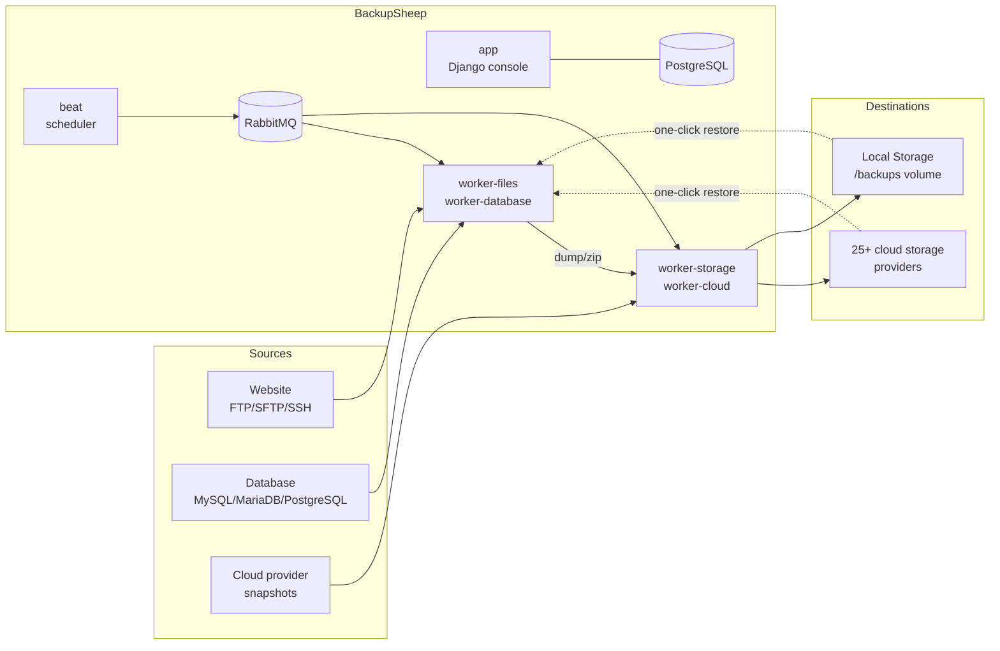

<p align="center">
  <picture>
    <source media="(prefers-color-scheme: dark)" srcset="apps/console/_static/console/images/logo_white_small.png">
    
  </picture>
</p>

<h1 align="center">BackupSheep</h1>

<p align="center">
  <strong>Self-hosted backup automation for databases, websites, servers and cloud infrastructure.</strong><br>
  Schedule backups, keep them on 25+ storage destinations or your own disk, and restore with one click.
</p>

<p align="center">
  <a href="LICENSE"></a>
  
  
  
  
</p>

> **Status: self-hostable (beta).** BackupSheep was a paid SaaS from 2017–2023 serving
> 6,500+ users. It has been rewritten and open-sourced as a self-hosted application: all
> SaaS/billing machinery has been removed so you can run it yourself. Licensed under the
> GNU GPLv3 (see [LICENSE](LICENSE)).

---

## Features

### Backup anything

| Source | Details |
|---|---|
| **Websites / files** | FTP, FTPS, SFTP, SSH. Include/exclude rules (regex + glob), parallel transfers, all key types (Ed25519/ECDSA/RSA, incl. passphrase-protected), server-side tar transport for SSH sources. |
| **Databases** | MySQL (bundled Oracle MySQL 8.4 client), MariaDB, PostgreSQL (version-matched `pg_dump` 14–18). Direct TCP or SSH tunnel, all databases or per-table selection, stored procedures, SSL/TLS. |
| **Cloud servers & volumes** | DigitalOcean, AWS (EC2, RDS, Lightsail), Hetzner, Linode, Vultr, UpCloud, Oracle Cloud, Google Cloud, OVH (CA/EU/US) — provider-native snapshots. |
| **SaaS apps** | WordPress, Basecamp. |

### Incremental website backups

Tired of re-downloading the whole site every night? **Incremental mode** mirrors the
site into a per-node local snapshot cache — after the first run, only new and changed
files cross the network (deletions propagate too). Every backup is still a complete,
standalone zip, so restores never depend on a chain. The cache rebuilds automatically
when connection or path settings change, and you can reset it from the node page.
Or stick with classic **Full mode** — every file, every time.

### 26 storage destinations

Amazon S3, Backblaze B2, Wasabi, Cloudflare R2, DigitalOcean Spaces, Google Cloud
Storage, Google Drive, Azure Blob, Dropbox, OneDrive, pCloud, IDrive e2, IBM COS,
Oracle, Scaleway, Linode, Vultr, UpCloud, Exoscale, Filebase, IONOS, Leviia, RackCorp,
Tencent COS, Alibaba OSS — plus **Local Storage**: keep backups as plain zip files on
the BackupSheep server's own disk (or any bind-mounted path/NFS). Push every backup to
several destinations at once.

### One-click restores

Select any historical backup and restore it straight from the console:

- **Websites** — files are pushed back to the server (lftp reverse mirror), optionally
  with *exact mirror* (`--delete`) to remove anything that isn't in the backup.
- **Databases** — dumps are imported with the native client, creating databases that
  no longer exist; works for direct and SSH-tunnel connections.
- Restores are tracked runs with live status and run logs — you always know what
  happened and when.

### Built to be trusted with big jobs

- **No silent partial backups** — every transfer's exit status is verified (lftp,
  `mysqldump`, `pg_dump`, SSH remote commands); a single failed file fails the run so
  it retries instead of archiving a gap.
- **Disk-space preflight** — engines check free space against the expected dump size
  before starting, instead of dying mid-dump.
- **Resume-friendly** — interrupted transfers continue (`--continue`), retries reuse
  the same backup record, and concurrent runs of the same node are serialized.
- **Credential hygiene** — secrets are encrypted at rest, travel via temp
  `defaults-extra-file`/`.pgpass`/env instead of process arguments, and are redacted
  from all run logs.
- **Proven at scale** — verified against sites with 100k+ files and multi-GB databases,
  with restore-tested zips (every dump is re-imported in CI-style end-to-end runs).

### Operations

Schedules (daily/weekly/monthly + cron) with keep-last retention · on-demand backups ·
failure notifications (email, Slack, Telegram) · team accounts with members · REST API
for everything the console does · specialized Celery worker queues you can scale
independently.

---

## Quick start (Docker Compose)

You need [Docker](https://docs.docker.com/get-docker/) with the Compose plugin, and `git`.

```bash
git clone <your-fork-or-this-repo-url> backupsheep
cd backupsheep

cp .env_sample .env
# Edit .env and set at least:
#   DJANGO_SECRET_KEY  -> a long random string (python -c "import secrets; print(secrets.token_urlsafe(64))")
#   DB_PASSWORD        -> a database password of your choice
# The other defaults already target the bundled db/rabbitmq services.

docker compose up --build
```

Open **http://localhost:8000/** — the first-run wizard guides you through creating the
admin account, email, storage, and your first source.

> The app serves plain HTTP on port 8000 and is meant to sit behind your own
> TLS-terminating reverse proxy in production. Before exposing it, read
> **[docs/deployment.md](docs/deployment.md)**.

---

## How it works



One Docker image runs as several services so a heavy backup can't starve the web UI:
**app** (gunicorn + WhiteNoise), **migrate** (one-shot migrations), **worker-cloud**,
**worker-database**, **worker-files**, **worker-storage**, **worker-logs**, and a
singleton **beat** scheduler — backed by PostgreSQL and RabbitMQ. Technology: Django 6,
Celery, Alpine.js + Tailwind CSS. See [docs/scaling.md](docs/scaling.md).

---

## Documentation

| Guide | What's in it |
|-------|--------------|
| [Installation](docs/installation.md) | Prerequisites, Docker Compose setup, the `.env` you must edit |
| [Configuration](docs/configuration.md) | Environment-variable reference, incl. `BS_LOCAL_STORAGE_PATH` |
| [First-run wizard](docs/first-run.md) | The 5 setup steps; admin accounts & `/django-admin` |
| [Usage](docs/usage.md) | Sources, storage, schedules, backup modes, retention, **restores** |
| [Providers](docs/providers.md) | Every backup source & storage destination, and what each needs |
| [Production deployment](docs/deployment.md) | HTTPS/reverse proxy, hardening, storage volumes, secrets |
| [Scaling & operations](docs/scaling.md) | Worker queues, scaling uploads, the beat singleton, multi-host |
| [Troubleshooting](docs/troubleshooting.md) | Common failures, FAQ, known limitations |

Also: [SECURITY.md](SECURITY.md) · [CONTRIBUTING.md](CONTRIBUTING.md)

---

## License

BackupSheep is free software under the **GNU General Public License v3.0**. It comes
with **no warranty** — see [LICENSE](LICENSE). You may run, study, modify, and
redistribute it under the terms of the GPLv3.
