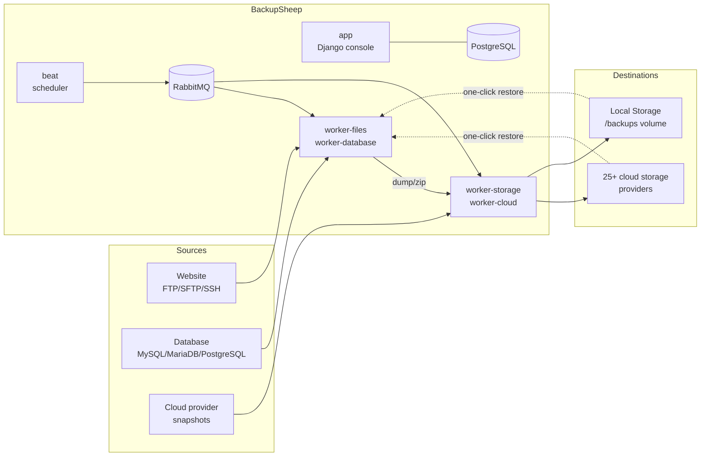

<p align="center">
  <picture>
    <source media="(prefers-color-scheme: dark)" srcset="apps/console/_static/console/images/logo_white_small.png">
    
  </picture>
</p>

<h1 align="center">BackupSheep</h1>

<p align="center">
  <strong>Self-hosted backup automation for databases, websites, servers and cloud infrastructure.</strong><br>
  Schedule backups, keep them on 25+ storage destinations or your own disk, and restore with one click.
</p>

<p align="center">
  <a href="LICENSE"></a>
  
  
  
  
</p>

> **Status: self-hostable (beta).** BackupSheep was a paid SaaS from 2017–2023 serving
> 6,500+ users. It has been rewritten and open-sourced as a self-hosted application: all
> SaaS/billing machinery has been removed so you can run it yourself. Licensed under the
> GNU GPLv3 (see [LICENSE](LICENSE)).

---

## Features

BackupSheep's stock self-hosted artifact encryption is local and does not require
AWS KMS, AWS credentials, or an AWS account. The installer creates separate,
installation-bound keyrings for database and file backups; AWS remains an optional
source or storage integration only when an operator chooses it.

### Backup anything

| Source | Details |
|---|---|
| **Websites / files** | FTPS, SFTP, SSH, and explicit opt-in legacy FTP. Include/exclude rules (regex + glob), parallel transfers, all key types (Ed25519/ECDSA/RSA, incl. passphrase-protected), server-side tar transport for SSH sources. Plain FTP is disabled by default because it exposes credentials and backup data. |
| **Databases** | MySQL (bundled Oracle MySQL 8.4 client), MariaDB, PostgreSQL (version-matched `pg_dump` 14–18). Direct TCP or SSH tunnel, all databases or per-table selection, stored procedures, SSL/TLS. |
| **Cloud servers & volumes** | DigitalOcean, AWS (EC2, RDS, Lightsail), Hetzner, Vultr, UpCloud, Oracle Cloud, Google Cloud, OVH (CA/EU/US) — provider-native snapshots. |
| **SaaS apps** | Basecamp. |

### Incremental website backups

Tired of re-downloading the whole site every night? **Incremental mode** mirrors the
site into a per-node local snapshot cache — after the first run, only new and changed
files cross the network (deletions propagate too). Every backup is still a complete,
standalone zip, so restores never depend on a chain. The cache rebuilds automatically
when connection or path settings change, and you can reset it from the node page.
Or stick with classic **Full mode** — every file, every time.

### 26 storage destinations

Amazon S3, Backblaze B2, Wasabi, Cloudflare R2, DigitalOcean Spaces, Google Cloud
Storage, Google Drive, Azure Blob, Dropbox, OneDrive, pCloud, IDrive e2, IBM COS,
Oracle, Scaleway, Linode, Vultr, UpCloud, Exoscale, Filebase, IONOS, Leviia, RackCorp,
Tencent COS, Alibaba OSS — plus **Local Storage**: keep backups as plain zip files on
the BackupSheep server's own disk (or any bind-mounted path/NFS). Push every backup to
several destinations at once.

### Immutable S3 archives and lifecycle controls

For Amazon S3 destinations, enable Object Lock governance or compliance retention on
every new archive, prevent BackupSheep cleanup from creating misleading delete markers,
and designate a protected air-gapped copy that a schedule must successfully validate
before it starts. Configure a prefix-scoped lifecycle rule to tier older archives to
cold S3 classes, then enter your contracted rates to see projected cost by source and
destination. See [immutable backups & lifecycle controls](docs/immutable-backups-and-lifecycle.md).

### One-click restores

Select any historical backup and restore it straight from the console:

- **Websites** — files are pushed back to the server (lftp reverse mirror), optionally
  with *exact mirror* (`--delete`) to remove anything that isn't in the backup.
- **Databases** — dumps are imported with the native client, creating databases that
  no longer exist; works for direct and SSH-tunnel connections.
- Restores are tracked runs with live status and run logs — you always know what
  happened and when.

### Built to be trusted with big jobs

- **No silent partial backups** — every transfer's exit status is verified (lftp,
  `mysqldump`, `pg_dump`, SSH remote commands); a single failed file fails the run so
  it retries instead of archiving a gap.
- **Disk-space preflight** — engines check free space against the expected dump size
  before starting, instead of dying mid-dump.
- **Resume-friendly** — interrupted transfers continue (`--continue`), retries reuse
  the same backup record, and concurrent runs of the same node are serialized.
- **Credential hygiene** — secrets are encrypted at rest, travel via temp
  `defaults-extra-file`/`.pgpass`/env instead of process arguments, and are redacted
  from all run logs.
- **Proven at scale** — verified against sites with 100k+ files and multi-GB databases,
  with restore-tested zips (every dump is re-imported in CI-style end-to-end runs).

### Operations

Live dashboard (stat cards, storage usage, recent and upcoming runs, failures needing
attention) · schedules (daily/weekly/monthly + cron) with keep-last retention ·
on-demand backups · backup & restore notifications by email, Slack and Telegram ·
team accounts with invite links, groups, granular permissions and per-node scoping ·
account-wide activity log (including sign-in tracking) · REST API for everything the
console does · specialized Celery worker queues you can scale independently.

---

## Quick start

### Verified server install

The host operator supplies Git, Docker Engine 28.0.0+ and Docker Compose 2.33.1+.
Choose a reviewed release commit, download the installer from that exact immutable
commit, inspect it, and run it as the unprivileged user already authorized for Docker:

```bash
COMMIT='<40-character-reviewed-release-commit>'
curl -fSLo install.sh \
  "https://raw.githubusercontent.com/bilal414/backupsheep/${COMMIT}/install.sh"
less install.sh
chmod 700 install.sh
./install.sh --ref "${COMMIT}" --domain backups.example.com
```

Do not pipe a remote script to a shell. The installer does not install packages or
change Docker, firewall, kernel, daemon, TLS, DNS, or service configuration. It verifies
the exact checkout, generates protected file-backed secrets, builds the image, and starts
only PostgreSQL, RabbitMQ, migrations, the security preflight, and the web UI. Provider
workers and Beat require a later explicit `--enable-operations` after recovery state and
credentials have been reviewed.

The initial install binds plain HTTP to `127.0.0.1:8000`; do not open that port publicly.
Use the printed SSH tunnel for onboarding, then put the app behind HTTPS. See
[Production deployment](docs/guides/production.md).

### DigitalOcean Droplet

DigitalOcean App Platform's deploy button supports only a single service (optionally with
a development database), while BackupSheep needs a web process, queue worker, scheduler,
database, and broker. Create an Ubuntu 22.04+ or Debian 12+ Droplet, then use the
[verified installer](docs/digitalocean-droplet.md). It deploys the complete Docker
Compose definition with persistent volumes, while leaving backup workers and Beat off
until the operator explicitly enables operations.

### Other cloud VMs

The same complete installer works on fresh Ubuntu 22.04+ or Debian 12+ VMs from **AWS**,
**Azure**, **Google Cloud**, **Hetzner**, **Vultr**, **Akamai/Linode**, **OVHcloud**,
**Scaleway**, **UpCloud**, and similar providers. The [cloud VM guide](docs/cloud-vms.md)
includes the exact verified-install commands. Unattended root cloud-init installation is
intentionally disabled; host provisioning remains the operator's responsibility. This is
the preferred path for durable local archives and independently scalable worker pools.

### Managed one-click platforms

BackupSheep does not ship Render, Heroku, or Railway one-click templates. Their
monolithic worker and shared-environment models cannot satisfy the production lane,
file-keyring, filesystem, and identity boundaries. Use the verified Docker installer on
a VM, or the documented split-process non-Docker deployment contract; do not adapt an old
one-click manifest for production.

### Manual Docker Compose install

The manual path uses the same exact-commit checkout, `.secrets` file mounts, core-only
default startup, and explicit `operations` profile. Follow the complete
[Docker installation guide](docs/guides/installation.md); a plain `.env` containing
database or broker passwords is no longer the supported security model. Use the shipped
`./backupsheep-compose` wrapper for manual operations so ambient Compose/Bake/profile
variables and implicit override discovery cannot change the reviewed model.

After the core preflight passes, open **http://localhost:8000/** on the Docker host. The
first-run wizard guides you through creating the admin account, email, storage, and your
first source.

> The app serves plain HTTP on port 8000 and is meant to sit behind your own
> TLS-terminating reverse proxy in production. Before exposing it, read
> **[Production deployment guide](docs/guides/production.md)**.

---

## How it works


```mermaid
flowchart LR
    subgraph Sources
        A[Website<br/>FTP/SFTP/SSH]
        B[Database<br/>MySQL/MariaDB/PostgreSQL]
        C[Cloud provider<br/>snapshots]
    end

    subgraph BackupSheep
        D[app<br/>Django console]
        E[beat<br/>scheduler]
        F[worker-files<br/>worker-database]
        G[worker-storage<br/>worker-cloud]
        H[(PostgreSQL)]
        I[(RabbitMQ)]
    end

    subgraph Destinations
        J[25+ cloud storage<br/>providers]
        K[Local Storage<br/>/backups volume]
    end

    A & B --> F
    C --> G
    E --> I --> F & G
    D --- H
    F -->|dump/zip| G
    G --> J & K
    J & K -.->|one-click restore| F
```

One Docker image runs as several services so a heavy backup can't starve the web UI:
**app** (gunicorn + WhiteNoise), **migrate** (one-shot migrations), **worker-cloud**,
**worker-database**, **worker-files**, **worker-storage**, **worker-logs**, and a
singleton **beat** scheduler — backed by PostgreSQL and RabbitMQ. Technology: Django 6,
Celery, Alpine.js + Tailwind CSS. See [docs/scaling.md](docs/scaling.md).

---

## Documentation

The [documentation hub](docs/README.md) is the best starting point. It separates
current user and operator guidance from dated engineering test reports.

| Area | Start here |
|-------|------------|
| Install and configure | [Installation](docs/guides/installation.md) · [Configuration](docs/guides/configuration.md) · [First run](docs/guides/first-run.md) |
| Learn the product | [Feature guide](docs/features/README.md) · [Core concepts](docs/features/core-concepts.md) · [Console workflows](docs/features/console-workflows.md) |
| Sources and destinations | [Backup sources](docs/features/backup-sources.md) · [Storage destinations](docs/features/storage-destinations.md) · [Provider matrix](docs/reference/provider-matrix.md) |
| Backups and recovery | [Schedules and policies](docs/features/schedules-and-policies.md) · [Executions and history](docs/features/executions-and-history.md) · [Restores](docs/features/restores.md) |
| Teams and alerts | [Teams, tenancy, and API access](docs/features/teams-tenancy-and-api-access.md) · [Notifications](docs/features/notifications.md) |
| Automate | [REST API](docs/api/README.md) · [Endpoint reference](docs/api/reference.md) · [Bruno collection](bruno/README.md) |
| Operate safely | [Production](docs/guides/production.md) · [Operations](docs/guides/operations.md) · [Upgrades](docs/guides/upgrades.md) · [Disaster recovery](docs/guides/disaster-recovery.md) · [Troubleshooting](docs/guides/troubleshooting.md) |
| Technical reference | [Architecture](docs/reference/architecture.md) · [Environment variables](docs/reference/environment-variables.md) |

Also: [SECURITY.md](SECURITY.md) · [CONTRIBUTING.md](CONTRIBUTING.md)

---

## License

BackupSheep is free software under the **GNU General Public License v3.0**. It comes
with **no warranty** — see [LICENSE](LICENSE). You may run, study, modify, and
redistribute it under the terms of the GPLv3.
