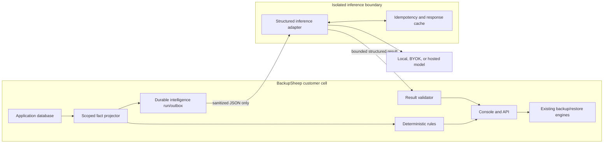

# Architecture and contracts

This file defines the contracts every implementation workstream must share. Proposed
names are intentionally explicit; an ADR may rename them, but an agent must not silently
change their semantics.

## 1. Trust zones



Trust rules:

- The fact projector and rules engine are trusted application code with read access only
  to rows already authorized for the requesting principal.
- The inference boundary is untrusted with respect to truth and instructions. It receives
  no database credentials, provider credentials, SSH keys, `_storage`, `/backups`, raw
  logs, or application environment.
- The result validator treats every model field as hostile until schema, size, hash,
  evidence references, safe enums, freshness, and scope have passed.
- Existing backup and restore engines never import intelligence modules and never wait
  for intelligence queues.
- The hosted control plane is a separate trust zone described in
  [`04-community-cloud-and-fleet.md`](04-community-cloud-and-fleet.md).

## 2. Proposed application layout

Because this project exposes a single Django app through `apps/console/models.py`, the
initial implementation should use:

```text
apps/console/intelligence/
    __init__.py
    models.py                 additive persisted contracts
    facts.py                  allowlisted projections
    objectives.py             recovery-policy normalization
    rules.py                  deterministic readiness and diagnosis rules
    evidence.py               evidence registry and reference creation
    redaction.py              prohibited-field and canary checks
    schemas.py                versioned JSON schemas
    providers.py              provider-neutral inference interface
    services.py               transaction and orchestration services

apps/api/v1/intelligence/
    __init__.py
    permissions.py
    serializers.py
    views.py
    urls.py

apps/_tasks/intelligence/
    __init__.py
    prepare.py
    dispatch.py
    results.py
    recovery.py
    briefs.py

apps/tests/intelligence/
    fixtures/
    test_facts.py
    test_readiness_rules.py
    test_permissions.py
    test_api.py
    test_runtime_recovery.py
    test_output_validation.py
    test_red_team.py
```

Model imports must be added once, by the evidence-model owner, to
`apps/console/models.py`. All schema migrations belong in `apps/_migrations/` and must be
additive during the first release.

## 3. Persisted data model

### 3.1 `CoreRecoveryObjective`

Purpose: store the customer’s explicit recovery policy. Observed schedule cadence is
evidence, not an implied customer objective.

Proposed fields:

- `uuid`;
- `account` and one-to-one `node`;
- nullable `rpo_minutes`;
- nullable `minimum_verified_copies`;
- nullable `restore_test_max_age_days`;
- nullable `require_air_gap`;
- nullable `require_immutability`;
- `source`: `explicit` or a future documented policy template;
- `policy_version`;
- `updated_by`, `created`, and `modified`.

Rules:

- A null value means not configured. It must not be replaced by a hidden product default.
- Account/node consistency is validated on every write and covered by database/application
  tests.
- Only the primary member or a member with the eventual `intelligence_manage` permission
  may write an objective.
- Updates create an activity-log event with a safe diff; no secrets or node connection
  details are logged.

### 3.2 `CoreRecoveryEvidence`

Purpose: normalize proof without overloading “backup complete.”

Proposed fields:

- `uuid`, `account`, and `node`;
- generic optional reference to a backup row;
- generic optional reference to a restore/rehearsal row;
- safe `correlation_id`;
- `evidence_type`: `artifact_integrity`, `destination_integrity`, `restore_completed`,
  `workload_verified`, `cleanup_verified`;
- `result`: `passed`, `failed`, or `unknown`;
- `verifier_type`, `rule_version`, `observed_at`, and optional `expires_at`;
- allowlisted `details` with its own schema version;
- canonical `evidence_sha256`.

Rules:

- `CoreBackupArtifact.verified_at` can create integrity evidence, not workload recovery
  evidence.
- A restore reaching a terminal `complete` state can create `restore_completed`; only an
  explicit application assertion/marker test can create `workload_verified`.
- A future recovery-rehearsal workflow must record isolated target identity, assertions,
  measured RTO, cleanup proof, actor, and exact source copy.

### 3.3 `CoreIntelligenceSetting`

Purpose: provide per-account opt-in without putting hosted entitlements into the GPL core.

Proposed fields:

- one-to-one `account`;
- `enabled`, default `False`;
- `allow_external_inference`, default `False`;
- `brief_frequency`: `off`, `daily`, or `weekly`;
- `snapshot_retention_days` and `output_retention_days`, bounded by deployment policy;
- `updated_by`, `created`, and `modified`.

Provider endpoint and credentials remain deployment configuration, not user-supplied API
fields. Hosted commercial entitlements remain in the separate control plane.

### 3.4 `CoreIntelligenceSnapshot`

Purpose: freeze exactly what an intelligence run was allowed to see.

Proposed fields:

- `uuid`, `account`, `purpose`, and `schema_version`;
- `scope_principal_id` and `scope_node_set_sha256`;
- optional safe execution correlation reference;
- allowlisted `facts` JSON;
- `facts_sha256` over canonical JSON;
- `captured_at`, `expires_at`, `sensitivity_class`;
- `created_by` or scheduled-recipient identity.

Rules:

- Scope is resolved before facts are queried.
- A snapshot created for one member cannot be reused for another unless the principal and
  visible-node-set hashes match exactly.
- Node/execution references sent to inference are snapshot-local pseudonyms. Raw node IDs,
  provider IDs, object keys, hostnames, or connection names are not included.
- Read access reauthorizes the current user and rejects expired or now-out-of-scope output.

### 3.5 `CoreReadinessFinding`

Purpose: persist deterministic rule results and lifecycle changes.

Proposed fields:

- `uuid`, `account`, `node`;
- stable `rule_code`, `rule_version`, `severity`, and `state`;
- deterministic `finding_fingerprint`;
- safe `evidence_refs` and `remediation_code`;
- `first_observed_at`, `last_observed_at`, `resolved_at`;
- snapshot/facts hash that produced the finding.

The same facts and rule version must produce the same fingerprint and finding. AI cannot
write or alter these rows.

### 3.6 `CoreIntelligenceRun`

Purpose: durable job, audit record, and initial outbox for an optional inference request.

Proposed fields:

- `uuid`, `account`, `requester`, `purpose`, and snapshot FK;
- `status`: `pending`, `dispatched`, `running`, `complete`, `failed`, `cancelled`;
- unique `request_sha256`, stable `task_id`, and caller idempotency-key digest;
- `provider_mode`, `model_id`, `prompt_version`, and output schema version;
- dispatch lease owner/token/expiry, attempts, `next_retry_at`, and timestamps;
- gateway request ID, safe error code, token counts, latency, and estimated cost;
- no raw prompt, model credentials, or raw failed response.

The row is committed before dispatch. Recovery republishes the same stable task ID and
request hash. The inference gateway must deduplicate by request hash; the result consumer
must suppress duplicate outputs.

### 3.7 `CoreIntelligenceOutput`

Purpose: store only a validated, customer-displayable result.

Proposed fields:

- one-to-one intelligence run;
- `schema_version` and validated `result`;
- `snapshot_sha256`, `output_sha256`, and referenced evidence IDs;
- `safety_flags`, `validated_at`, and `expires_at`.

Invalid raw output is discarded after bounded diagnostics. Persist a safe failure code and
hash, not the hostile response body.

### 3.8 `CoreIntelligenceFeedback`

Purpose: collect bounded quality signals without turning customer data into training data.

Proposed fields:

- run, member, `helpful`, `correct`, and `unsafe` flags;
- bounded reason code;
- optional length-limited comment with separate retention policy;
- timestamps.

Feedback is not used for model training without a separate, explicit opt-in and governance
process.

## 4. Model-facing fact contracts

### 4.1 Common envelope

```json
{
  "schema_version": "bs.ai.facts.v1",
  "purpose": "failure_investigation",
  "snapshot_ref": "snap_opaque",
  "facts_sha256": "sha256-hex",
  "captured_at": "2026-08-12T23:00:00Z",
  "expires_at": "2026-08-12T23:15:00Z",
  "subject": {
    "source_ref": "src_01",
    "execution_ref": "exec_01",
    "source_kind": "database",
    "provider_family": "s3_compatible"
  },
  "facts": {},
  "evidence": []
}
```

Required model-facing transformations:

- `provider_operation_id` -> `operation_pointer_present: true|false`;
- immutable request fingerprint -> `request_identity_complete: true|false`;
- provider ownership data -> `ownership_state: verified|mismatch|unknown`;
- artifact manifest -> counts and `manifest_state`, never keys/checksums;
- raw reconciliation metadata -> safe state/reason code;
- restore checkpoints -> counts, phases, and deterministic `can_resume`/resume-mode enum;
- raw timestamps -> exact UTC timestamps and derived ages calculated deterministically.

### 4.2 Failure facts

```json
{
  "status": "failed",
  "phase": "provider_reconciliation",
  "safe_error_code": "PROVIDER_RECONCILIATION_REQUIRED",
  "attempts": 2,
  "next_retry_at": null,
  "provider_status": "reconciling",
  "reconciliation": {
    "state": "required",
    "reason_code": "provider_reconciliation_required"
  },
  "artifact": {
    "source_verified": true,
    "verified_destination_count": 2,
    "integrity_failure_count": 0
  },
  "identity": {
    "request_identity_complete": true,
    "operation_pointer_present": false,
    "ownership_state": "unknown"
  },
  "resume": {
    "can_resume": false,
    "mode": null
  },
  "history": {
    "same_error_7d": 1,
    "successful_runs_30d": 27,
    "median_duration_seconds_30d": 340
  }
}
```

### 4.3 Failure Investigator output

```json
{
  "schema_version": "bs.ai.failure-investigation.v1",
  "facts_sha256": "sha256-hex",
  "headline": "The provider outcome must be reconciled before another request is sent.",
  "current_state": "manual_review",
  "confirmed_facts": [
    {"text": "The create outcome is unresolved.", "evidence_ids": ["ev_01"]}
  ],
  "likely_causes": [
    {
      "cause_code": "PROVIDER_RESPONSE_LOST",
      "confidence": "medium",
      "explanation": "The durable state has no accepted resource pointer.",
      "evidence_ids": ["ev_02"]
    }
  ],
  "next_steps": [
    {
      "remediation_code": "WAIT_FOR_OR_REVIEW_RECONCILIATION",
      "reason": "A duplicate create must be avoided.",
      "evidence_ids": ["ev_01", "ev_02"]
    }
  ],
  "warnings": ["Do not start a second provider operation."],
  "missing_evidence": [],
  "as_of": "2026-08-12T23:00:00Z"
}
```

Rules:

- Every confirmed fact requires evidence IDs.
- A likely cause uses an allowlisted cause code and remains explicitly hypothetical.
- Every next step uses a deterministic remediation code. The model can explain/order it
  but cannot invent shell commands, URLs, API calls, or action payloads.
- Manual review, unknown provider outcome, missing ownership, or multiple matches always
  includes a no-new-mutation warning.
- Integrity failure always warns against restoring that copy.
- Authentication errors never ask the user to paste a credential into chat.

### 4.4 Readiness snapshot

The deterministic engine evaluates these independent dimensions:

- coverage and active schedule;
- freshness against explicit RPO;
- source and per-destination artifact integrity;
- verified copy count;
- actual air-gap evidence;
- recorded immutability/retention evidence;
- unresolved failures, retries, and reconciliation;
- recent workload-verified recovery rehearsal;
- optional cost exposure for authorized principals only.

Posture enum:

- `verified_ready` — every configured objective passes and a non-expired
  `workload_verified` rehearsal exists;
- `protected_not_rehearsed` — backup/copy objectives pass but workload-level recovery
  proof is absent or expired;
- `at_risk` — at least one configured objective has a deterministic failing finding;
- `unknown` — policy or required evidence is unconfigured/insufficient.

Do not add an opaque numeric score in v1.

```json
{
  "schema_version": "bs.readiness.v1",
  "snapshot_ref": "snap_opaque",
  "facts_sha256": "sha256-hex",
  "as_of": "2026-08-12T23:00:00Z",
  "posture": "at_risk",
  "objective": {
    "rpo_minutes": 1440,
    "minimum_verified_copies": 2,
    "restore_test_max_age_days": 90,
    "require_air_gap": true,
    "require_immutability": true
  },
  "findings": [
    {
      "finding_id": "finding_01",
      "rule_code": "RPO_MISSED",
      "severity": "critical",
      "source_ref": "src_01",
      "evidence_ids": ["ev_08"],
      "remediation_code": "REVIEW_SOURCE_SCHEDULE"
    }
  ]
}
```

AI may produce a brief that references finding IDs. It cannot change posture, severity,
counts, objectives, or remediation codes.

## 5. API contracts

All paths are provisional but their security behavior is required.

| Endpoint | Behavior | Permission |
| --- | --- | --- |
| `GET /api/v1/intelligence/readiness/` | Deterministic posture/findings over the caller’s visible nodes; optional authorized `node_id` filter. | authenticated + scoped nodes |
| `GET /api/v1/intelligence/evidence/{uuid}/` | Safe evidence drill-down; reauthorizes current node visibility. | `intelligence_use` |
| `GET /api/v1/intelligence/data-preview/` | Shows the exact sanitized facts that would be sent for one authorized execution. | `intelligence_use` |
| `POST /api/v1/intelligence/explanations/` | Accepts execution kind and correlation ID; requires `Idempotency-Key`; returns `202` and run UUID. No free-text question in v1. | `intelligence_use` |
| `GET /api/v1/intelligence/runs/{uuid}/` | Returns durable status and validated output only; not-found on wrong scope. | run requester or current authorized scope |
| `POST /api/v1/intelligence/runs/{uuid}/feedback/` | Records bounded quality/safety feedback. | output viewer |
| `GET/PATCH /api/v1/intelligence/settings/` | Opt-in, brief, and retention controls. No model keys/endpoints in request bodies. | primary or `intelligence_manage` |
| `POST /api/v1/intelligence/briefs/` | Creates recipient-specific brief from current visible-node scope. | `intelligence_use`; scheduled account-wide brief initially primary only |

New permissions:

- `intelligence_use` — view scoped readiness and request explanations;
- `intelligence_manage` — manage account objectives, opt-in, retention, and briefs.

No v1 endpoint applies a schedule, starts/resumes/retries a backup or restore, deletes
anything, or calls a provider. A future typed-plan endpoint requires its own ADR and must
still use `schedule_changes`, an explicit diff hash, validation, and confirmation.

## 6. Queue and isolation contract

Do not route inference through `worker-cloud`. That process has application/provider
context and currently drains critical backup/recovery tasks.

Use three logical queues:

1. `intelligence_prepare`
   - trusted Django worker;
   - resolves scope, builds snapshot, runs deterministic rules, writes run/outbox;
   - never calls an LLM.
2. `intelligence_inference`
   - minimal isolated worker/sidecar;
   - receives only sanitized, size-bounded JSON;
   - has RabbitMQ access and only the selected model credential/endpoint;
   - mounts no application or backup volume and has no Django database/provider secrets;
   - uses a persistent request-hash cache or hosted gateway idempotency service.
3. `intelligence_results`
   - trusted Django worker;
   - validates output schema, size, facts hash, scope, expiry, enums, evidence references,
     and safety rules before persisting.

Required periodic jobs:

- recover pending/dispatched intelligence runs with the same stable task ID;
- expire snapshots and outputs according to policy;
- compute deterministic readiness findings;
- generate explicitly configured recipient-specific briefs;
- enforce usage/cost budgets without affecting deterministic results.

Crash tests must terminate each worker after its durable handoff and prove:

- run status remains queryable;
- replay uses the same request hash;
- only one output row becomes visible;
- the gateway avoids duplicate billable requests where the provider contract supports
  idempotency; otherwise bounded duplicate-cost risk is documented and budgeted;
- no backup/restore row, queue timing, or provider-operation count changes.

## 7. Provider modes and configuration

Deployment-level modes:

- `off` — default; deterministic product remains fully functional;
- `local` — administrator-configured local OpenAI-compatible endpoint;
- `byok` — administrator-configured external model and credential;
- `hosted` — BackupSheep managed inference endpoint and cell identity.

Proposed environment controls:

```text
INTELLIGENCE_ENABLED=false
INTELLIGENCE_MODE=off
INTELLIGENCE_PROVIDER=
INTELLIGENCE_MODEL=
INTELLIGENCE_ENDPOINT=
INTELLIGENCE_REQUEST_TIMEOUT_SECONDS=20
INTELLIGENCE_MAX_INPUT_BYTES=65536
INTELLIGENCE_MAX_OUTPUT_BYTES=32768
INTELLIGENCE_MAX_ATTEMPTS=2
INTELLIGENCE_DAILY_BUDGET_CENTS=0
INTELLIGENCE_SNAPSHOT_RETENTION_DAYS=7
INTELLIGENCE_OUTPUT_RETENTION_DAYS=30
```

Rules:

- Endpoint and credential configuration is instance-administrator controlled, not a
  normal account API field.
- Startup validation rejects an enabled mode with incomplete configuration.
- Logs display mode/model/version and safe run UUID, never keys, prompt bodies, raw
  output, or customer facts.
- Timeouts, retry counts, byte limits, and budgets have strict upper bounds.
- Provider/model/prompt upgrades run through the evaluation gate before rollout.

## 8. Initial event flows

### Failure Investigator

1. Authenticate user.
2. Resolve the correlation ID through the user’s current account and `visible_nodes()`.
3. Build allowlisted facts and evidence references.
4. Calculate deterministic state, warnings, and remediation choices.
5. Return deterministic output immediately if AI is off/unavailable.
6. Otherwise commit snapshot and run before publishing.
7. Inference produces structured output against the exact facts hash.
8. Result worker validates everything and stores only a safe output.
9. UI polls the durable run and displays evidence-linked sections.
10. No operational action exists in this flow.

### Recovery Readiness

1. Resolve objectives and observed facts per visible node.
2. Run versioned deterministic rules.
3. Upsert findings by stable fingerprint and record lifecycle changes.
4. Render posture and drill-down without a model call.
5. For an enabled brief, create a recipient-specific snapshot.
6. AI may explain only the existing findings/priorities.
7. Validate and persist the brief before notification fan-out.
8. Notification failure cannot change findings or readiness posture.

## 9. Migration and rollback strategy

- Add tables and indexes only in the first release.
- Do not rewrite existing execution, artifact, restore, or log rows.
- Generate snapshots on demand first; later backfill deterministic findings in bounded
  primary-key batches.
- Never backfill raw logs into an AI dataset.
- Shadow rules before showing them; shadow AI before exposing narratives.
- Enable cohorts in order: test fixtures, internal/demo, design partners, Community
  opt-in, hosted beta.
- Operational rollback is feature-flag and queue shutdown. Existing backup/restore paths
  remain intact while intelligence rows are retained for audit/cleanup.
- A later migration may remove intelligence data only after documented export, retention,
  and deletion behavior exists.
