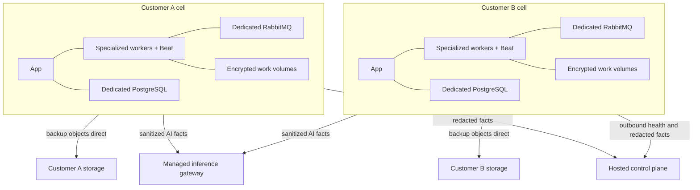

# Community, Cloud, and Fleet implementation plan

This plan keeps one complete open-source backup/recovery product while creating a hosted
business around safe operation, managed inference, fleet visibility, upgrades, support,
and service levels.

## 1. Edition contract

### BackupSheep Community

Must remain fully usable without any hosted service:

- all sources, destinations, schedules, retention, verification, backup, restore, retry,
  reconciliation, and API functionality;
- deterministic Recovery Readiness and evidence drill-down;
- Failure Investigator deterministic fallback;
- AI `off`, local, and BYOK paths where supported;
- data preview, intelligence export/deletion, and documented disable/removal;
- no mandatory call-home, subscription check, or safety/recoverability paywall.

### BackupSheep Cloud

Adds an operated service, not a crippled core:

- one dedicated customer cell initially;
- customer-owned archive storage first;
- managed provisioning, TLS, monitoring, upgrades, metadata backup/restore, and support;
- managed inference and proactive briefs;
- later SSO, SCIM, audit export, regional choices, and SLA;
- optional managed storage only after customer-owned storage operations are proven.

### BackupSheep Fleet/MSP

Sequence:

1. outbound-only enrollment;
2. read-only health, version, readiness, and normalized execution facts;
3. policy templates and drift visibility;
4. delegated customer scopes;
5. only later, signed/expiring/locally authorized remote commands.

The connector and facts protocol should be open source. Fleet control-plane operation,
cross-instance analytics, SSO/SCIM, support, and SLA are hosted value.

## 2. Repository and process boundaries

### Current repository

The current repository remains:

- Community source;
- the application runtime used inside each Cloud cell;
- deterministic intelligence engine;
- local/BYOK provider interface;
- open facts/evidence protocol and Fleet connector;
- cell capability/readiness endpoints.

Do not add billing SDKs, subscription enforcement, or hosted quotas to core backup safety
paths. `CONTRIBUTING.md` currently excludes SaaS billing/plans/managed-storage concepts;
hosted commercial policy therefore belongs outside this repository unless that project
policy is deliberately revised.

### Separate hosted control-plane repository

Responsibilities:

- customer, subscription, plan, and invoice references;
- cell, region, release, provisioning, upgrade, backup, and incident state;
- infrastructure secret references;
- health/SLO aggregation and support workflows;
- managed-inference gateway and budgets;
- Fleet UI and organization hierarchy.

It must not:

- import GPL application internals as a shared proprietary library;
- share the cell application database;
- store customer provider or archive credentials;
- proxy customer backup data;
- be required for a running cell to schedule, back up, restore, retry, or reconcile.

Communication uses versioned HTTPS/mTLS APIs and outbound facts/messages.

## 3. Current hosted-readiness findings

The latest `develop` runtime is not yet a production hosted service boundary:

- `/healthz/` always returns `ok`; it is liveness, not dependency readiness.
- The Compose stack shares PostgreSQL, RabbitMQ, and disk volumes within an installation.
- API authentication still includes persistent unscoped DRF tokens returned at login.
- Provider credentials and the per-account encryption key are in the application database;
  some email credential encryption depends on `DJANGO_SECRET_KEY`.
- Sentry tracing/profiling is configured at 100% when a DSN is present and needs explicit
  scrubbing/sampling policy.
- Session-authenticated API CSRF enforcement is fixed in current code, but `SECURITY.md`
  still describes the old disabled state.
- Production deployment documentation correctly warns that restoring encrypted settings
  requires the same secret material; this must become an automated, tested DR contract.
- The current provider wrap-up still has live acceptance, exact-owned cleanup, and exposed
  credential-rotation gates. Hosted marketing must not claim those complete.

These findings do not block documentation or a local intelligence prototype. They do block
broad hosted GA and formal enterprise claims.

## 4. Dedicated cell architecture



Initial compact cell:

- one customer VM or equivalent isolated compute boundary;
- dedicated database, broker, encrypted persistent work/cache volumes;
- app, singleton Beat, and specialized workers;
- unique network/firewall, DNS, TLS, secrets, and encryption material;
- only HTTPS exposed publicly;
- archive traffic goes directly to customer-owned storage.

No database, broker, work volume, namespace, provider credential, or application secret is
shared between customers.

## 5. H0 — hosted product and protocol contract

Deliver:

- feature/edition matrix;
- control-plane/cell API contract;
- facts protocol and capability negotiation;
- telemetry opt-in for Community and required service telemetry for Cloud;
- data-flow, region, retention, deletion, subprocessor, and support-access decisions;
- corresponding-source/build policy.

Acceptance:

- Community operates indefinitely while the control plane is unavailable.
- Control-plane requests cannot directly invoke a provider SDK inside a cell.
- Core safety behavior has no entitlement dependency.
- Every cross-boundary message is versioned, authenticated, bounded, and allowlisted.

## 6. H1 — managed-cell runtime contract

Add documented managed mode without changing Community semantics.

Required cell endpoints/signals:

- liveness;
- real readiness;
- build SHA and signed release identity;
- database schema/migration version;
- facts protocol/capability versions;
- scheduler and worker heartbeat age;
- queue depth/oldest age;
- work-volume availability/disk thresholds;
- current durable active/reconciliation/manual-review counts.

Readiness is not a public dump of internal state. It returns bounded safe status for the
cell agent/control plane.

Acceptance:

- PostgreSQL, RabbitMQ, migrations, Beat, required workers, writable volume, and disk
  thresholds are checked independently.
- A dependency failure changes readiness without taking away diagnostic liveness.
- Cloud policy can require external customer-owned storage before activation; Community
  retains Local Storage.
- AI disabled/unavailable does not change cell readiness for core backup service.
- No Community telemetry leaves the installation unless explicitly enabled.

## 7. H2 — idempotent cell infrastructure

Build one provider/one region first. Do not generalize to multi-cloud until lifecycle and
DR behavior are proven.

Every resource records immutable:

- `cell_id`;
- `customer_id`;
- provisioning operation/request ID;
- ownership tags/labels;
- exact provider resource ID in the control-plane ledger.

Acceptance:

- A retry after lost response adopts exactly one uniquely proven resource or stops for
  manual review.
- Zero, duplicate, ambiguous, partial-inventory, ownership-mismatch, and provider-read
  failures stop mutation.
- Twenty fault-injected create/retry/destroy cycles leave no duplicate or orphaned
  resources owned by the test runs.
- Cell reboot resumes durable backup/restore work without duplicate provider operations.
- Destruction uses exact ledger IDs plus current ownership proof; customer data deletion
  requires its own confirmation/retention workflow.

## 8. H3 — control plane and provisioner

Proposed durable cell state machine:

```text
REQUESTED
  -> INFRA_READY
  -> SECRETS_READY
  -> APP_READY
  -> STORAGE_VALIDATED
  -> ACTIVE

Any unsafe or ambiguous transition -> QUARANTINED
```

Additional operation records:

- provision;
- upgrade;
- backup/DR drill;
- support access;
- suspend/reactivate;
- export;
- delete.

Acceptance:

- Every transition is transactional/idempotent and durably audited.
- Fault injection after every state resumes the same logical operation.
- Only `STORAGE_VALIDATED` can enter `ACTIVE` for the initial BYOS offering.
- Failed or ambiguous cells enter `QUARANTINED`, never silently active.
- Single-use onboarding tokens expire and are stored hashed.
- Infrastructure secret references are stored; customer provider/storage credentials stay
  inside the cell.
- Control-plane shutdown does not affect running cell schedules or recovery.

## 9. H4 — identity, credentials, and support access

Before paying customers enter credentials:

- separate session signing, application encryption, credential encryption, and onboarding
  keys;
- envelope-encrypt cell secrets with a wrapping key held outside the cell database;
- define rotation and recovery for each key class;
- migrate existing encrypted records with reversible, tested phases;
- replace perpetual unscoped hosted API tokens with hashed, scoped, expiring, revocable
  credentials;
- require MFA for hosted administrators;
- implement time-limited, customer-approved, purpose-bound, audited support access;
- scrub and sample error/performance telemetry;
- protect against CSRF, SSRF, cross-cell access, insecure direct object references, and
  restore-permission bypass.

Acceptance:

- A restored cell can decrypt intended credentials using recovered key material.
- Database-only compromise does not reveal either externally recovered, lane-scoped
  local-file wrapping keyring.
- Support staff cannot read provider credentials or backup content through normal tooling.
- Emergency access expires automatically and produces an immutable audit event.
- Independent penetration test has no unresolved critical/high issue before GA.

## 10. H5 — signed release and upgrade controller

Release artifacts:

- signed OCI image;
- exact source commit and corresponding-source link;
- SBOM and dependency-license report;
- schema compatibility range;
- facts protocol compatibility;
- migration reversibility/rollback metadata;
- expected container/worker topology.

Upgrade sequence:

```text
preflight
  -> stop new dispatch
  -> allow or safely pause/drain active work
  -> encrypted metadata snapshot
  -> migrate
  -> deploy exact image
  -> dependency readiness
  -> recovery-state audit
  -> resume dispatch
```

Acceptance:

- Existing durable execution/provider IDs survive upgrades.
- Kill/fail every stage and prove resume or documented rollback.
- Expand/contract migrations permit N/N-1 operation where promised.
- Irreversible migration blocks unsafe code-only rollback.
- Rollout order is internal cell, demo, opted-in design partners, staged production.
- Controller stops automatically on readiness, queue age, error rate, duplicate-operation,
  or recovery regression.
- Ten staged upgrades, including worker and host kills, preserve logical work.

## 11. H6 — cell and control-plane disaster recovery

Cell recovery artifacts must include:

- application database;
- encrypted configuration;
- necessary independent key-recovery material;
- release/schema manifest;
- infrastructure ledger and volume/storage configuration;
- queue/reconciliation state needed to recover safely.

Customer backup archives remain in customer-owned storage and are not copied through the
control plane.

Acceptance:

- Rebuild a cell in a clean environment from encrypted recovery artifacts.
- Restored credentials decrypt and BYOS archives remain discoverable.
- Pending/in-progress work reconciles without a second provider mutation.
- Loss of work cache triggers safe rebuild/failure, never silent partial success.
- Control-plane loss does not affect running cells.
- Three successive drills meet measured private-beta targets before an SLA is published.
- Planning targets, to validate rather than promise: metadata RPO <=1 hour and cell RTO
  <=4 hours.

## 12. H7 — operations and support

Monitor:

- app/API availability and latency;
- worker/Beat heartbeat;
- queue depth and oldest message;
- database/broker health;
- disk/work-volume pressure;
- active, stuck, retrying, reconciliation, manual-review backup/restore counts;
- provider-safe error classifications;
- intelligence queue/error/cost state;
- version, schema, and configuration drift.

Acceptance:

- Alerts contain `cell_id` and safe correlation IDs only.
- Every page has severity, owner, tested runbook, and escalation path.
- Support uses normalized evidence, not direct credential access.
- Private beta states no availability SLA.
- A 99.9% GA SLA is considered only after at least 90 days of measured operation, staffed
  on-call, tested incident communication, and DR evidence.

## 13. H8 — outbound read-only Fleet connector

Enrollment:

- one-time short-lived token;
- installation generates identity;
- rotating mTLS certificate;
- outbound connection only;
- local disable/revoke and data preview.

Default exported fields:

- installation/cell pseudonym;
- version/capability/readiness;
- normalized execution status/timestamps/counts;
- deterministic readiness findings and evidence references;
- no raw logs, manifests, filenames, archive content, provider IDs, or credentials.

Acceptance:

- Fleet outage has zero local impact.
- Scope and organization isolation tests pass.
- Connector protocol is versioned and backwards compatible.
- Read-only ships before remote actions.
- A future command is signed, scoped, expiring, idempotent, locally authorized,
  confirmation-gated, and fully audited; Fleet itself never calls provider SDKs.

## 14. H9 — licensing, source, and customer exit

Before substantial external contributions or GA:

- clarify `GPL-3.0-only` versus `GPL-3.0-or-later`;
- complete contribution provenance and dependency-license audit;
- decide DCO versus CLA; use legal review if future dual licensing is a goal;
- publish trademark and official-hosted-service policy;
- publish security support/version policy;
- link each distributed image to exact complete corresponding source;
- publish privacy policy, DPA, subprocessors, data regions, retention/deletion, incident
  response, support terms, and BYOS responsibilities;
- document Community -> Cloud migration;
- document Cloud -> self-hosted export/offboarding;
- prove cell/customer deletion and legal-hold behavior.

Retain GPLv3 for the first hosted launch unless legal review recommends otherwise. Do not
move to AGPL merely because hosting is planned; network copyleft and contributor rights
require a deliberate legal/procurement decision.

## 15. Hosted go/no-go gates

| Gate | Required proof |
| --- | --- |
| Architecture | Two cells prove database/broker/volume/secret isolation; control-plane shutdown has no core impact. |
| Provisioning | 20 fault-injected lifecycles create no duplicates/orphans and fail closed on ambiguous ownership. |
| Security | Lane-key separation and independent keyring custody, scoped tokens, MFA, telemetry scrubbing, support access, and penetration test pass. |
| Upgrade | 10 staged upgrades with process/host kills preserve logical executions and provider-operation identity. |
| DR | 3 clean-environment recoveries meet measured RPO/RTO and decrypt intended configuration. |
| Product beta | At least 5 active design partners complete onboarding, backup, and restore/rehearsal workflows with sustainable support load. |
| AI | All zero-tolerance privacy/safety gates and pilot metrics pass. |
| Provider credibility | Current live acceptance, exact-owned cleanup, deployment provenance, and exposed credential rotation are closed or explicitly excluded from claims. |
| GA/SLA | 90 days of SLO evidence, staffed incident response, completed legal/customer-exit docs, and positive per-cell contribution margin. |
