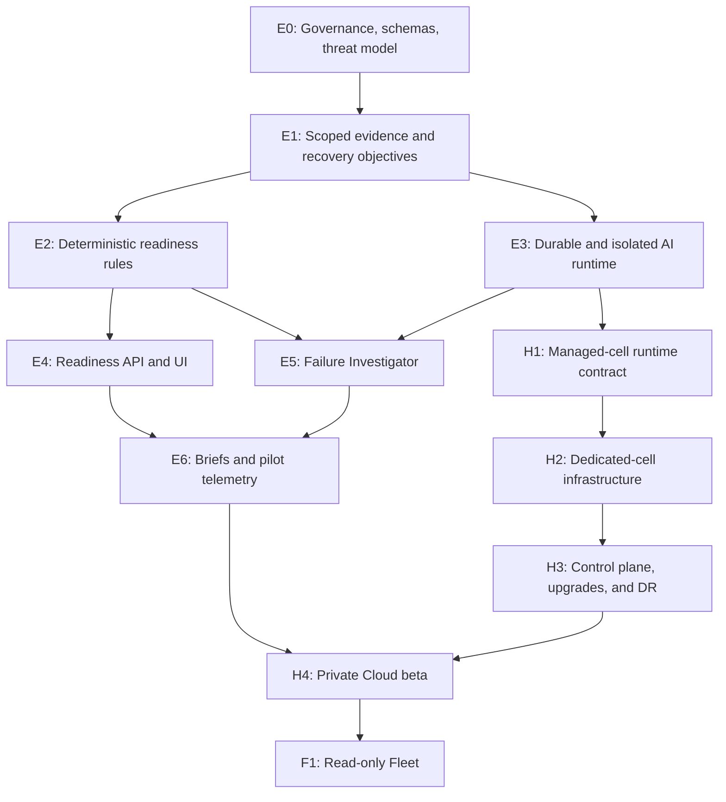

# BackupSheep Recovery Intelligence implementation plan

> **Status:** planning only. This directory contains implementation instructions for
> future agents. It does not authorize code, infrastructure, provider, deployment, or
> licensing changes.

## Baseline reviewed

This plan was refined against the latest fetched committed `develop` branch on
2026-08-12. The branch advanced once during planning, so the final reviewed baseline is:

- local branch: `develop`;
- local and remote SHA: `b7d44b9151bf3bec2db9a296a6af2c6463f89abf`;
- latest code-bearing commit: `b7d44b9151bf3bec2db9a296a6af2c6463f89abf`,
  `Handle empty UpCloud restore firewalls`;
- the authoritative provider wrap-up recorded 1,564/1,564 passing application tests at
  the preceding deployment checkpoint; that receipt does not establish a full-suite or
  demo-deployment result for `b7d44b9`, so agents must revalidate the latest head;
- the remaining provider cleanup, live acceptance, and credential-rotation gates in
  [`provider-live-e2e-wrap-up-20260812.md`](../provider-live-e2e-wrap-up-20260812.md#remaining-acceptance-gates)
  are still real and must not be hidden by AI product work;
- concurrent uncommitted changes observed after `b7d44b9` in
  `apps/console/node/models.py` and
  `apps/tests/test_upcloud_server_firewall_reliability.py` are not part of this baseline
  and were deliberately not inspected as committed product behavior or modified here.

Before executing any item, an agent must fetch `origin/develop`, record the new base SHA,
read changes since the baseline above, and update the relevant ADR if an assumption has
drifted. Do not reset, overwrite, or absorb unrelated worktree changes.

## Product decision

Build **Recovery Intelligence**, not a generic backup chatbot.

The first public slice combines:

1. **Deterministic Recovery Readiness** — shows whether each protected source meets an
   explicitly configured recovery policy and exactly which evidence supports the result.
2. **Read-only Failure Investigator** — explains a failed, delayed, retrying, or
   reconciliation-bound execution using a sanitized evidence snapshot.

The enduring system invariant is:

```text
durable operational state
    -> allowlisted and scoped facts
    -> deterministic findings
    -> optional AI explanation
    -> existing RBAC, validation, confirmation, fencing, and idempotent APIs
```

AI is never the source of truth for execution state, artifact integrity, ownership,
recoverability, severity, authorization, or provider mutation.

## Why `develop` changed the implementation plan

The current branch contains substantially more reliable evidence than the earlier AI
exploration assumed:

| Latest `develop` capability | Implementation consequence |
| --- | --- |
| Durable phase, retry, progress, provider state, and reconciliation in `CoreBackupExecution` | Build the fact projector from durable columns, not Celery state or prose logs. |
| Per-copy checksums, byte counts, object versions, manifests, and verification timestamps in `CoreBackupArtifact` | Readiness can distinguish a completed row from a verified artifact, but must not call artifact verification a restore proof. |
| Provider request fingerprints, immutable witnesses, exact ownership checks, and bounded full-inventory adoption | Export derived booleans and safe categories; never export raw provider IDs, fingerprints, manifests, or response bodies to a model. |
| Categorized provider/storage error codes | Use error codes as deterministic diagnosis and remediation keys. The model may explain and order allowlisted remedies, not invent them. |
| Same-row cloud and logical-database restore resume with durable proof and bounded history | Show `can_resume` and safe resume mode as facts. AI cannot infer safety from an error message or create a new restore. |
| Hard-kill and lost-response acceptance hooks | Reuse this fault-injection style for intelligence queues and hosted provisioning. |
| Narrow restore-preflight support for an enabled but initially empty UpCloud firewall chain in `b7d44b9` | Preserve stage-specific semantics in derived facts. Never generalize “empty” to “safe”; the normal backup canonicalizer continues to fail closed. |

Primary evidence locations:

- [`CoreBackupExecution`](../../apps/console/backup/models.py),
  `CoreBackupArtifact`, and `CoreBackupRequest`;
- safe execution projection in
  [`apps/api/v1/backup/serializers.py`](../../apps/api/v1/backup/serializers.py);
- pure durable-state resume proof in
  [`apps/api/v1/backup/database/serializers.py`](../../apps/api/v1/backup/database/serializers.py);
- tenant/node scoping in
  [`apps/api/v1/utils/api_helpers.py`](../../apps/api/v1/utils/api_helpers.py);
- group permission handling in
  [`apps/api/v1/utils/api_permissions.py`](../../apps/api/v1/utils/api_permissions.py);
- worker routing and recovery sweeps in
  [`backupsheep/settings.py`](../../backupsheep/settings.py).

## Product and repository boundaries

| Edition | Required boundary |
| --- | --- |
| BackupSheep Community | Complete GPLv3 backup/restore engine, deterministic readiness, evidence export, AI off/local/BYOK choices, and no mandatory call-home. |
| BackupSheep Cloud | The same application operated in a dedicated customer cell, initially with customer-owned storage, plus managed inference, upgrades, monitoring, metadata DR, and support. |
| BackupSheep Fleet | Read-only cross-instance facts first through an outbound connector; approval-gated remote operations only after the read-only protocol is proven. |
| Hosted control plane | Separate repository and process boundary for customers, subscriptions, cell lifecycle, releases, monitoring, support, and Fleet. It must not share the application database or possess customer provider credentials. |

The current Compose stack is a strong single-instance cell runtime. Its shared database,
broker, and disk volumes are not a hostile multi-tenant security boundary. The first
hosted version must use one isolated cell per customer.

## Plan map

Agents must read this README and the file for their workstream before editing code:

1. [`01-architecture-and-contracts.md`](01-architecture-and-contracts.md) — trust
   boundaries, proposed models, schemas, APIs, queues, feature flags, and event flows.
2. [`02-agent-workstreams.md`](02-agent-workstreams.md) — epic ownership, task-level
   backlog, dependencies, file boundaries, tests, and handoff requirements.
3. [`03-evaluation-security-and-privacy.md`](03-evaluation-security-and-privacy.md) —
   threat model, prohibited data, offline and online evaluations, red-team cases, and
   hard release thresholds.
4. [`04-community-cloud-and-fleet.md`](04-community-cloud-and-fleet.md) — open-source
   boundary, hosted cells, control plane, upgrades, DR, identity, licensing, and Fleet.
5. [`05-delivery-roadmap.md`](05-delivery-roadmap.md) — 90-day sequence, critical path,
   staffing, milestone gates, pilot plan, and go/no-go decisions.

## Dependency graph



## Release slices

### Slice A — useful with AI disabled

- Explicit recovery objectives.
- Versioned, recipient-scoped evidence snapshots.
- Deterministic readiness findings and evidence drill-down.
- Deterministic failure state and allowlisted remediation catalog.
- Data-preview screen showing exactly what could leave the installation.

### Slice B — AI in shadow mode

- Durable intelligence runs and isolated inference boundary.
- Structured Failure Investigator output.
- Evidence-reference, schema, scope, freshness, and safety validation.
- Offline evaluation and internal review; no customer-visible narrative.

### Slice C — opt-in Community and design-partner alpha

- Local/BYOK explanation mode, default off.
- Hosted managed-inference alpha for explicit design partners.
- Recovery Readiness dashboard and per-execution explanation.
- Feedback and safety reporting.

### Slice D — private hosted beta

- Dedicated managed cells and customer-owned storage.
- Automated provisioning, upgrades, rollback, metadata backup/restore, and monitoring.
- Managed inference and support evidence bundles.
- No SLA until measured operations and DR gates pass.

## Non-negotiable rules for implementation agents

1. **Start read-only.** Record `git status`, `develop`, `origin/develop`, the exact base
   SHA, and relevant migration head before changing anything.
2. **One epic per branch/worktree.** Use `codex/ai-e<epic>-<slug>` unless the maintainer
   requests another convention.
3. **Respect file ownership.** The workstream plan assigns integration hotspots such as
   `apps/console/models.py`, `apps/api/v1/urls.py`, `backupsheep/settings.py`, and
   `docker-compose.yml` to one agent at a time.
4. **Additive first release.** Do not alter backup/restore state machines to implement
   intelligence. Add models, projections, rules, APIs, queues, and UI behind flags.
5. **AI off by default.** Community backup, restore, retry, reconciliation, dashboard,
   and scheduler behavior must remain complete when every intelligence process is down.
6. **Scope before projection.** Resolve account and `visible_nodes()` before building a
   snapshot. Never build an account-wide narrative and filter it afterward.
7. **No raw operational data.** Raw logs, exceptions, provider metadata, notes,
   credentials, URLs, filenames, archive content, and provider response bodies cannot
   enter prompts or model-facing broker messages.
8. **No AI actions in v1.** The first AI endpoints are read-only. Future typed drafts
   require a separate project gate and the existing permission/confirmation path.
9. **Fail closed.** Invalid schema, missing evidence, stale facts, scope change, hash
   mismatch, model timeout, or malformed output produces deterministic fallback—not a
   partially trusted narrative.
10. **Verify crash behavior.** Kill workers at every handoff, recreate RabbitMQ, and
    prove queryable state, bounded retry, duplicate-result suppression, and no change in
    provider-operation counts.
11. **Preserve existing gates.** An AI PR is not allowed to redefine the open provider
    acceptance items as complete.
12. **Documentation is part of done.** Every schema, rule code, setting, permission,
    retention behavior, and failure mode must be documented and versioned.

## Global definition of done

No customer-visible alpha is complete until all of the following are true:

- deterministic readiness has 100% agreement with its golden rule corpus;
- restricted-member and cross-account scope tests pass with no data differences or
  timing leaks considered material by review;
- displayed AI output is 100% schema valid and every operational fact cites an evidence
  ID in the exact snapshot;
- secret-canary, prompt-injection, stale-snapshot, and cross-tenant suites have zero
  disclosures;
- there are zero unsupported critical claims, zero claims that AI “verified” a backup,
  and zero destructive or direct-provider recommendations;
- AI outage, disabled mode, queue backlog, malformed output, and model rate limits have
  zero effect on backup/restore outcomes and provider-operation counts;
- the existing full reliability suite remains green;
- security, privacy, model-retention, cost-budget, and rollback reviews are signed off;
- user-facing copy clearly distinguishes artifact integrity, completed restore, and
  workload-verified recovery rehearsal.

Hosted beta and GA have additional gates in
[`04-community-cloud-and-fleet.md`](04-community-cloud-and-fleet.md).

## Decisions the maintainer must approve before implementation

| Decision | Recommended default |
| --- | --- |
| Product name | Recovery Intelligence |
| First features | Deterministic Recovery Readiness and read-only Failure Investigator |
| First customer | Agencies and small SaaS/DevOps teams managing 10–50 protected workloads |
| Readiness score | No opaque number in v1; show posture and rule findings |
| Policy defaults | Do not invent RPO/copy/rehearsal objectives; unconfigured means unknown |
| AI modes | `off` by default, then local/BYOK, then managed hosted inference |
| Backup content | Never sent to inference in v1 |
| AI actions | None in v1 |
| Hosted topology | Dedicated single-tenant cells |
| Backup storage | Customer-owned first |
| License | Retain GPLv3 initially; complete identifier, provenance, trademark, and contributor-rights review |
| Billing unit | Protected workload/cell, not prompts or seats |

## Explicitly deferred

- Semantic search over backup contents.
- Free-form SQL or arbitrary operational query generation.
- Autonomous backup, restore, retry, resume, deletion, or provider mutation.
- Shared-database multi-tenant SaaS.
- Managed backup storage before customer-owned storage is operationally stable.
- AI-generated readiness severity or recoverability decisions.
- Fleet remote actions before the outbound read-only facts protocol is proven.
