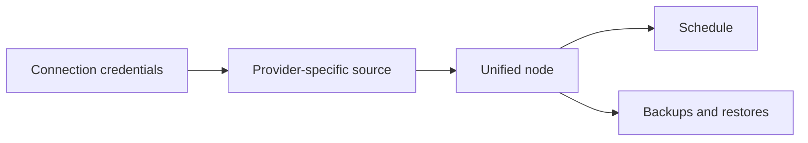

# Common API workflows

These sequences show how the API resources fit together. Provider-specific required
fields differ, so use the corresponding Bruno request for the exact JSON body.

## 1. Inspect the current identity

1. `POST /api/v1/auth/login/`
2. Save `api_key` outside source control.
3. `GET /api/v1/check/login/`
4. `GET /api/v1/accounts/` and `GET /api/v1/members/` if the identity belongs to more
   than one account.

Use `Authorization: Token {{apiKey}}` on every subsequent request.

Provider OAuth is a browser-session workflow, not a bearer-token automation workflow.
DigitalOcean and OVH authorization starts use `POST .../oauth_url/` and require the
console's CSRF proof when authenticated by cookie. That explicit POST restarts the
provider transaction; merely rendering or refreshing a console GET page preserves a
still-valid, account/member-bound state instead of rotating it.

## 2. Add and validate a source

A protected source is normally assembled from three resources:

Example for a website:

1. Create credentials with `POST /api/v1/connections/website/`.
2. Validate them with `POST /api/v1/connections/website/{connection_id}/validate/`.
3. Discover remote objects, when needed, with the connection's `objects` action.
4. Create the website source with `POST /api/v1/websites/` and the connection ID.
5. Read the unified node from `GET /api/v1/nodes/`.
6. Validate the node with `POST /api/v1/nodes/{node_id}/validate/`.

For databases use `/connections/database/` and `/databases/`. For cloud servers,
managed databases, SaaS sources, and volumes, use the matching provider under
`/connections/`, then `/clouds/`, `/saas/`, or `/volumes/`.

## 3. Add and validate storage

1. Select a destination from the provider matrix.
2. Create it with `POST /api/v1/storage/{provider}/`.
3. Validate live access with
   `POST /api/v1/storage/{provider}/{storage_id}/validate/`.
4. Confirm it appears in `GET /api/v1/storage/` or `/api/v1/storage/all/`.

Validation can perform a live write/read/delete probe for object storage. Use a bucket
or path intended for BackupSheep and credentials restricted to that scope.

For S3 Object Lock and lifecycle controls, use the S3 fields documented in the storage
guide and `POST /api/v1/storage/aws_s3/{storage_id}/sync_lifecycle/` only after reviewing
the intended bucket policy and cost behavior.

## 4. Create a schedule

Create a schedule with `POST /api/v1/schedules/`. A schedule links one or more nodes to
one or more storage destinations and defines timing and retention behavior.

Useful actions:

- `POST /api/v1/schedules/{id}/trigger/` — enqueue this schedule now;
- `POST /api/v1/schedules/{id}/pause/` — stop future scheduled occurrences;
- `POST /api/v1/schedules/{id}/resume/` — resume future occurrences.

Triggering is asynchronous. Monitor created backups rather than treating the action's
HTTP response as backup completion.

## 5. Run an on-demand backup

1. Generate a unique idempotency key.
2. Call `POST /api/v1/nodes/{node_id}/take_snapshot/` with that header.
3. Read `GET /api/v1/nodes/{node_id}/backup_request_status/`.
4. List the matching backup family, optionally with `?node={node_id}`.
5. Poll the backup detail until its status is terminal.
6. Inspect `execution_status` and `storage_points` before relying on the archive.

Retry a failed file/database/SaaS backup with the backup family's `retry` action. A
provider snapshot may have a provider-specific reconciliation path instead. Do not
blindly create a second request after an unknown provider outcome.

## 6. Inspect copies; do not directly download BSE1 archives

File-producing backup families retain some of these routes:

- `download` — compatibility route; it refuses current BSE1 artifacts rather than
  returning ciphertext as a ZIP or exposing a provider URL;
- `download_transfer_log` — transfer/run log;
- `download_dir_tree` — website directory inventory;
- `storage_points` — copies of this backup by destination.

Local storage also exposes
`GET /api/v1/storage/local/file/{stored_backup_id}/`; it returns `409 Conflict` for a
BSE1 artifact. The self-hosted build also does not provide the former SaaS-hosted
transfer-log and directory-tree download objects. Use the durable execution state,
storage-point status, activity log and authenticated database/website restore routes.

Do not weaken these refusals with a web `/backups` mount or an ad hoc ciphertext stream.
If a reviewed legacy-artifact deployment still returns a signed URL, treat the URL and
downloaded content as secrets and never write them to CI logs.

## 7. Restore a backup

Database and website backups expose `POST .../{backup_id}/restore/` and a `restores`
history action. Cloud restore starts from
`POST /api/v1/nodes/{node_id}/restore_backup/`. Vultr managed database and Lightsail
bucket replication have dedicated restore endpoints.

Always:

1. select the exact completed backup;
2. inspect the provider/source-specific request body;
3. send a unique `Idempotency-Key` where supported or required;
4. prefer an isolated target;
5. poll restore history to a terminal state;
6. verify the restored system independently.

Some failed or ambiguous provider restores expose `resume_restore`. Use it only when
the returned restore status says verification can be resumed; it is a reconciliation
operation, not a generic duplicate restore button.

## 8. Configure notifications

Use the channel-specific resources:

- `/api/v1/notifications-email/`
- `/api/v1/notifications-slack/`
- `/api/v1/notifications-telegram/`

Email configurations can send a verification email. Slack and Telegram provide a
validation action. Instance-level provider/app credentials still need to be configured
by the operator before a channel can work.

## 9. Delegate team access

1. Create or update a group through `/api/v1/groups/`.
2. Assign the smallest set of custom permissions and visible nodes.
3. Create an invite with `/api/v1/invites/`.
4. Resend or cancel the invite through its action endpoint if necessary.
5. Review members and membership state through `/api/v1/members/`.

Membership and current-account actions can immediately alter what a token can see or
change. Test delegated automation with its own member instead of the primary account.
