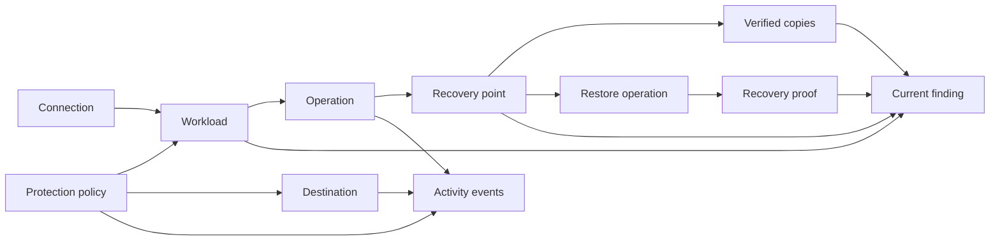

# Information architecture

## IA objective

The console should mirror the operator's actual mental model:

```text
I protect workloads
  with connections, destinations, and policies;
I monitor durable operations;
I recover from recovery points;
I use evidence to know whether recovery is ready;
I use activity history to understand who changed what.
```

The current labels—Nodes, Sources, Integrations, Logs, Add source—mix inventory,
configuration, operations, and audit concepts. The proposed architecture gives each
object one stable name and one obvious home.

## Product objects and relationships



The model deliberately separates:

- **Configuration:** Connection, Workload, Protection policy, Destination.
- **Operations:** Backup, snapshot, verification, restore, retry, reconciliation.
- **Recovery evidence:** Recovery point, Copy, Recovery proof, Finding.
- **Governance:** Activity, Member, Role/group, Invitation, Notification channel.

## Navigation

### Desktop

Use an approximately 248–256px fixed navigation column only when the viewport can support
it without compressing operational content. Recommended grouping:

```text
[BackupSheep mark + name]

RECOVER
  Recovery

PROTECT
  Workloads
  Operations
  Protection policies

INFRASTRUCTURE
  Connections
  Destinations

WORKSPACE
  Activity
  Settings

[Current workspace]
[Member menu]
```

Rules:

- `Recovery` is the default route and always means the deterministic overview, not an
  AI assistant.
- `Operations` combines backup and restore execution, with type filters.
- `Activity` remains the audit trail and is not renamed to Operations.
- `Connections` never includes storage destinations.
- `Destinations` never includes source credentials.
- The selected workspace and access scope must be visible in the shell.
- Do not show inaccessible navigation and then fail at click time. Hide or disable based
  on the same permission contract used by the route.

### Tablet and mobile

- At roughly 1180px and below, use an accessible off-canvas drawer rather than a narrow
  icon-only rail. Icons without stable labels would increase learning cost.
- The drawer uses the same grouping and order as desktop.
- The top bar includes: menu, current page, freshness/attention indicator when relevant,
  and the member menu.
- Avoid a bottom navigation bar: eight destinations and permission-dependent entries do
  not fit without hiding important structure.
- The drawer is removed from the tab order while closed, traps focus while open, closes
  on Escape/backdrop, prevents background scroll, and returns focus to the menu button.

## Header and page chrome

The current global `Add source` button appears even on Settings and Activity. Replace it
with a contextual action model:

| Page | Primary action | Secondary action |
| --- | --- | --- |
| Recovery | Add workload, only for authorized users and setup state | Review findings |
| Workloads | Add workload | Manage connections |
| Operations | None by default | Filter / export if authorized |
| Protection policies | Create policy | None |
| Connections | Add connection | None |
| Destinations | Add destination | None |
| Activity | None | Export if later supported and authorized |
| Settings | Save within the affected section | None globally |

Header structure:

```text
[workspace / scope]  Page title  [as-of or live-state annotation]   [context action] [member]
```

Do not duplicate the same title in the global header and page body. The body can add a
specific operational headline or description, while the shell owns the route title.

## Page map

### Recovery

Purpose: answer current recoverability, evidence, and required action.

Children or drill-down routes:

- current finding detail;
- filtered Workloads by posture;
- filtered Operations by live/manual-review state;
- recovery-proof detail;
- readiness configuration, once objectives exist.

### Workloads

Purpose: inventory and compare everything the current principal may protect.

Views:

- All;
- At risk;
- Unknown;
- No policy;
- Paused;
- filter by type, connection, provider, policy, destination, posture, and text.

Workload detail tabs:

1. **Recovery** — current point, copies, proof, findings, and recover action.
2. **Runs** — backup/snapshot and restore operations scoped to the workload.
3. **Protection** — schedules, retention, objectives, destinations, and notifications.
4. **Configuration** — connection/resource details and validation.
5. **Activity** — audit trail scoped to the workload.

Use route-backed tabs so deep links, refresh, browser history, and authorization work
without keeping a giant page alive. Preserve the old detail URL as a Summary/Recovery
alias during migration.

### Operations

Purpose: monitor current and historical backup and restore work.

Top-level views:

- Live;
- Needs review;
- History;
- optional filters for Backup, Snapshot, Verification, Restore, Rehearsal.

Operation detail shows durable timeline, progress, retry/reconciliation, safe error,
evidence/copies, related workload and policy, actor/trigger, and allowed actions.

### Protection policies

Purpose: make schedules, retention, required copy count, and later recovery objectives
visible as reusable operating intent.

The existing per-node schedules can first appear as workload-specific policies without a
database redesign. Reuse/sharing is a later decision and must not be implied in the first
screen if the backend remains one schedule per node.

### Connections

Purpose: source/provider access and discovery.

Examples: AWS, DigitalOcean, UpCloud, Oracle Cloud, SSH/SFTP, database server,
and Basecamp.

Each connection shows validation state, last validation, accessible workload count,
scope/region, backup server, affected findings, and actions allowed by permissions.

### Destinations

Purpose: storage for website/database/application copies.

Each destination shows validation state, last successful write/read/delete probe,
verified copies, affected workloads/policies, capacity/footprint, immutability or air-gap
evidence, cost where authorized, and downstream impact before pause/delete.

Provider-native snapshots remain associated with their provider and workload; do not
pretend they are off-site destination copies.

### Activity

Purpose: immutable audit history of human and system events.

Filters should use user-facing categories and offer codes/details as secondary content.
Activity is not the primary failure-investigation or run-monitoring surface.

### Settings

Use a two-level settings layout with a shared partial rather than eight copied tabs:

```text
PERSONAL
  Profile
  Password
  Multi-factor authentication

WORKSPACE
  General
  Notification policy
  Notification channels

ACCESS
  Members
  Invitations
  Roles and groups
```

The account/workspace switcher belongs in the shell. Settings may manage memberships but
should not be the only place the current workspace is visible.

## Route transition

Do not combine label changes, route removal, and backend contract changes in one release.

| Current route | Initial redesign behavior | Long-term route | Compatibility rule |
| --- | --- | --- | --- |
| `/console/` | Recovery landing page | same | Stable. |
| `/console/nodes/` | Label as Workloads | `/console/workloads/` optional | Keep current URL as alias or canonical until all deep links migrate. |
| `/console/nodes/<id>/` | Recovery/Summary tab | `/console/workloads/<id>/recovery/` optional | Old route redirects or renders same scoped view. |
| `/console/logs/` | Activity | `/console/activity/` optional | Preserve query parameters during redirect. |
| `/console/integration/` | Choice between protect and destination paths | `/console/connections/new/` plus `/console/destinations/new/` | Keep provider callbacks and bookmarks valid. |
| `/console/integration/<code>/` | Connection catalogue/detail | `/console/connections/<code>/` optional | Preserve provider-specific logic and callback URLs. |
| `/console/integration/storage/<code>/` | Destination catalogue/detail | `/console/destinations/<code>/` optional | Preserve OAuth redirects. |
| none | Operations list/detail | `/console/operations/`, `/console/operations/<correlation>/` | Add only with a scoped read model. |
| none | Policies | `/console/policies/` | Initially project existing schedules; do not invent reuse. |
| `/console/settings/*` | Grouped settings navigation | same initially | Stable forms and API calls. |

Use route names rather than hard-coded paths in templates. Add redirects only after route
and callback tests cover query strings, fragments, and provider OAuth behavior.

## Roles and permission-aware IA

The IA must support at least these perspectives:

| Principal | Expected experience |
| --- | --- |
| Account owner | All scoped data and all authorized actions, including workspace/access administration. |
| Team operator | Assigned or unrestricted workloads according to group scope; only group-granted actions. |
| Client/read-only user | Assigned workload evidence and allowed downloads/history; no global account totals or setup prompts. |
| No assigned workloads | Explicit “No workloads assigned to you” state; no account-wide zero, storage total, or Add workload prompt. |

Rules:

- Resolve current membership and `visible_nodes(member)` before every aggregate.
- Hide counts for data categories the principal cannot access.
- Owner-only destination economics stay owner-only unless a separate permission is
  approved.
- An unavailable action explains the required permission or owner contact only when
  doing so does not expose hidden object existence.
- Guessed IDs for hidden workloads, operations, recovery points, copies, or findings
  return the same non-enumerating response as a nonexistent object.

## Search, filters, and saved views

### Initial release

- Page-local search for Workloads, Operations, Connections, Destinations, and Activity.
- URL-backed filters so views are linkable and browser Back works.
- Active filter chips with a single clear-all action.
- Server-side pagination; no full-account DOM rendering.
- Human labels in the primary UI, stable codes in detail/evidence views.

### Deferred

- Global command palette/search.
- Saved views and shared filters.
- Natural-language operational search.

Do not introduce global search until authorization, index freshness, and result-type
semantics are designed.

## Responsive content rules

| Content type | Wide screen | Narrow screen |
| --- | --- | --- |
| Recovery Ledger | Four evidence columns aligned across posture bands | One workload/posture summary with a horizontal evidence chain that wraps into labelled stages, not a cropped table |
| Operations | Comparison table with sticky identifier and state columns | Labelled records with workload, state, phase/progress, age, and one primary action |
| Workloads | Table or compact matrix | Risk-ordered records; type counts collapse into filter chips/summary |
| Settings | Left subsection navigation + content | Drawer/select for settings section; no clipped tab strip |
| Filters | Inline compact bar | `Filters (n)` drawer beneath search; applied chips remain visible |
| Destructive actions | Context menu and confirmation | Full-width confirmation sheet/page with impact summary |
| Evidence details | Two-column facts and timeline | Single-column definition list; identifiers wrap safely |

No critical action may exist only in a hover state. Do not use horizontal scrolling as the
primary solution for an action-heavy operational list.

## Onboarding architecture

The first-run wizard and in-console add flow must agree about dependencies.

Entry question:

> What do you want to protect?

Branches:

- **Cloud server or volume:** connect provider -> select workload -> schedule/policy ->
  first snapshot -> recovery rehearsal prompt. Provider-native storage is explained.
- **Website or database:** connect source -> select or add destination -> schedule/policy
  -> first backup -> verify copies -> recovery rehearsal prompt.
- **Application/SaaS:** provider-specific connection -> destination if required -> policy
  -> first backup -> verification.

The dashboard new-installation state is a resumable checklist, not a set of empty metric
cards. It shows completed, current, blocked, and optional steps.

## IA acceptance criteria

- A first-time user can explain the difference between Connection, Workload, Destination,
  Policy, Operation, Recovery point, Copy, and Recovery proof after completing setup.
- An operator can reach a live operation in at most two navigation choices from any page.
- An operator can reach recovery for a workload without visiting Activity.
- Audit events are not mistaken for operation status.
- Source setup never labels a destination as a source.
- Every route and count uses the same scoped workload contract.
- Old deep links and provider callbacks continue to work during migration.
- The navigation remains understandable at 320px, 390px, 768px, 1024px, and 1440px.
