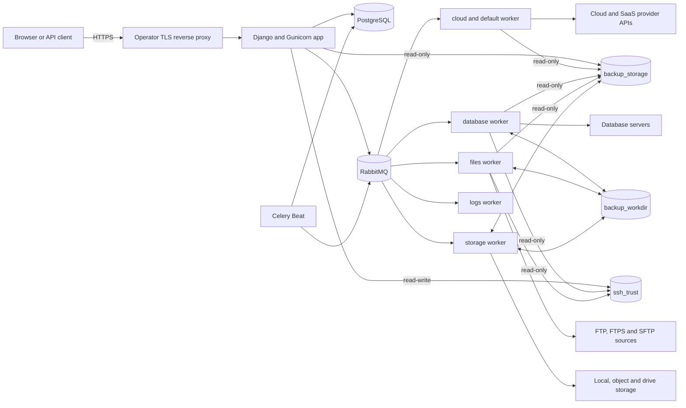
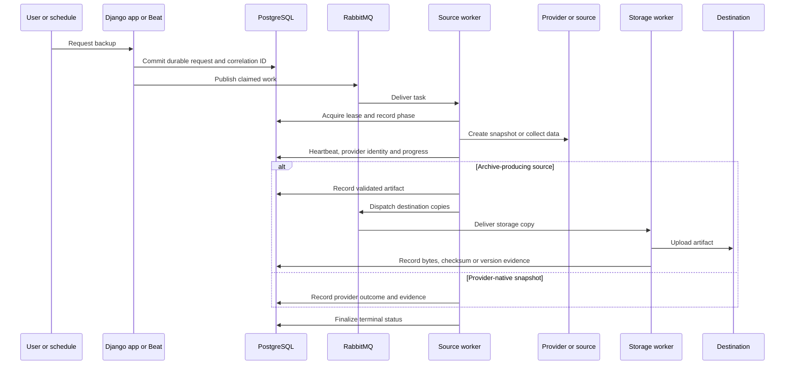

# Architecture

BackupSheep is a self-hosted Django control plane. It records configuration and durable
execution state in PostgreSQL, uses RabbitMQ to transport Celery work, and delegates
provider snapshots, data collection, storage copies and restores to separate worker
lanes. The stock deployment builds one application image for several roles and one
minimal derived PostgreSQL image.

## System context

The reverse proxy is an operator-supplied component; the repository does not ship a TLS
proxy. PostgreSQL, RabbitMQ, the app, workers and Beat are defined in
`docker-compose.yml`.

A profile-less Compose start deliberately runs only PostgreSQL, RabbitMQ, migrations, the
security preflight and the web app. Every provider worker and Beat belongs to the explicit
`operations` profile because enabling it can execute queued or recoverable provider work.

## Runtime components

| Component | Stock command or image | Responsibility | Scale notes |
| --- | --- | --- | --- |
| `db` | locally built `backupsheep-postgres:<commit>` rooted in digest-pinned `postgres:18.6-trixie` | Accounts, configuration, schedules, credentials, backup/restore records, leases and evidence | Image and Compose fix UID/GID `999:999`, drop every capability and exec PostgreSQL as non-root PID 1; fresh named volumes inherit ownership and imported drift fails closed; preserve the cluster's libc collation generation during updates |
| `rabbitmq` | digest-pinned `rabbitmq:4.3.5-alpine` | Durable Celery queues and persistent message delivery | Vendor entrypoint repairs the data-volume owner, drops privilege and execs RabbitMQ as non-root PID 1; dedicated credentials/vhost; backend network only |
| `migrate` | `python manage.py migrate --noinput` | Applies schema migrations before other application roles start | One-shot; must complete successfully |
| `preflight` | `python manage.py docker_preflight` | Fails closed on unsafe identity/capability/rootfs/secret/runtime settings, pending migrations, and unavailable database/broker dependencies | One-shot; must complete successfully |
| `app` | image entrypoint, then Gunicorn on port 8000 | Console, REST API, onboarding, connection validation and static files through WhiteNoise | Scale only behind a proxy and with shared state/mounts |
| `worker-cloud` | queues `cloud,default`, concurrency 4 | Provider API snapshots/restores and general work | Operations profile; no work-volume mount; Local Storage is read-only |
| `worker-database` | queue `database`, concurrency 1 | PostgreSQL, MySQL and MariaDB dump/restore work | Operations profile; CPU/disk heavy; shared work is writable, Local Storage read-only |
| `worker-files` | queue `files`, concurrency 1 | Website collection/restore plus WordPress and Basecamp collection | Operations profile; CPU/disk heavy; shared work is writable, Local Storage read-only |
| `worker-storage` | queue `storage`, concurrency 2 | Copies finished artifacts to destinations; finalizes, resets incremental caches, and cleans work/run-log files | Operations profile; only worker with writable Local Storage; scale for measured backlog |
| `worker-logs` | queue `logs`, concurrency 2 | Database activity entries, notifications and database-log pruning | Operations profile; no work or Local Storage mount |
| `beat` | database-backed `BackupDatabaseScheduler` | Scheduled backups, recovery sweeps and maintenance dispatch | Keep one instance for ordinary maintenance cadence |

Queue routing is declared in Django settings, not in Compose labels. Starting a generic
Celery worker without the intended queue set can starve a lane or run disk-touching work
where its files are absent.

**High residual risk:** the stock roles still share one RabbitMQ principal and vhost.
Queue names and worker mounts limit accidental execution but are not an authorization
boundary: a compromised broker-connected role can publish a task or command to another
role's queue. Enterprise deployments should treat this cross-role command-relay path as a
High risk until BackupSheep supports per-role broker principals/vhosts with enforceable
publish/consume permissions (or equivalent authenticated task envelopes).

Application roles run as UID/GID `10001:10001` with a read-only root, all Linux
capabilities dropped, `no-new-privileges`, bounded tmpfs/resource limits and no host/PID/IPC
namespace sharing. Database and broker connectivity use separate role-specific internal
bridges, while each outbound role gets a separate egress bridge. The stock stack mounts
only the secret files each role needs; the onboarding token is granted to `app` alone.

Every application-image command passes through the image entrypoint. It neutralizes
shell, Python, dynamic-loader and TLS-key-log startup hooks; verifies the fixed identity,
empty capability sets, `NoNewPrivs`, seccomp, Docker init, private mounts, read-only root
and absence of a Docker socket; and executes configured argv without shell evaluation.
After Compose's one-shot deployment gate, the same entrypoint runs `docker_preflight`
again before every web, worker and Beat process. This catches weakened settings or runtime
flags when Docker later auto-restarts a service without recreating the one-shot gate.

PostgreSQL's derived build verifies the exact official entrypoint bytes, replaces its
`gosu` transition with security-updated Debian `setpriv`, deletes `gosu`, asserts the
fixed util-linux family, and declares UID/GID `999:999`. Stock Compose repeats that user,
drops all capabilities, and starts PostgreSQL without a root ownership-repair phase.
RabbitMQ remains the sole deliberate bootstrap exception: its reviewed entrypoint gets a
narrow capability set to repair named-volume ownership, drops to the vendor UID, and
execs the non-root server. Neither service uses Docker's root-owned init shim. Verify UID,
capabilities and PID 1 whenever either pinned image changes.

## Persistence and filesystem topology

| Compose volume | Container path | Authoritative contents |
| --- | --- | --- |
| `pgdata` | `/var/lib/postgresql` | PostgreSQL cluster for the bundled database |
| `rabbitmq_data` | `/var/lib/rabbitmq` | Broker metadata and queued messages |
| `backup_workdir` | `/code/_storage` | In-flight artifacts, restore/run logs and website/database incremental caches |
| `ssh_trust` | `/var/lib/backupsheep/ssh-trust` | Shared SSH `known_hosts`; writable only by `app`, read-only in the database and files workers |
| `backup_storage` | `/backups` | Archives for the Local Storage destination |
| `installation_identity` | `/run/backupsheep-installation` in `app` (read-only) | Empty persistent ownership sentinel labeled with the installation's stable 64-hex ID; contains no application or secret data |

PostgreSQL is the control-plane source of truth. RabbitMQ is a delivery mechanism: a lost
message can be republished from durable request state by recovery sweeps. The work volume
contains important transient state but does not replace the database. `backup_storage` is
durable customer backup data whenever Local Storage is selected.

Roles that touch a file must see the same bytes at the same container path, but they do
not receive equal write access. Database/files/storage workers can write `backup_workdir`;
`app`, cloud, logs and Beat receive no staging mount. The app alone writes `ssh_trust` while
database/files mount it read-only; other roles do not receive it. Only storage writes
`/backups`; app/cloud/database/files read it, and logs/Beat receive no Local Storage mount.
`reset_incremental_cache` and on-disk `delete_old_logs` are routed to storage so the web
and notification roles do not need staging access. Reset is confined beneath the expected
node cache with directory-file-descriptor operations and no-follow checks, and takes the
same per-node incremental lock as archive/mirror work before deleting anything.

The optional managed SSH private key has a separate boundary. Compose mounts the
operator-owned `.secrets/ssh_managed_private_key` source read-only at
`/run/secrets/ssh_managed_private_key` only in app/database/files. The entrypoint treats an
empty source as disabled. A non-empty source must be a regular, NUL-free file no larger
than 64 KiB and an unencrypted key accepted by `ssh-keygen`; the entrypoint copies it into
private tmpfs as `/run/backupsheep/ssh/managed_private_key` with mode `0600`, then exports
that runtime path. SSH code must not use the mode-`0444` source path directly.

Docker named volumes satisfy byte visibility on one host. A multi-host deployment requires
a shared filesystem for `backup_workdir`; it also requires shared durable storage for
`/backups` when Local Storage is used. It also needs an explicitly managed SSH trust store
and a secure per-host delivery mechanism for the optional managed key. Preserve the same
role-specific read/write policy; a container-local directory is not sufficient.

See [Configuration](../guides/configuration.md#filesystem-configuration) and
[Disaster recovery](../guides/disaster-recovery.md) for mount and protection rules.

## Backup execution flow

The precise provider phases vary, but the common control flow is:

The request and execution rows are written before relying on the broker. The execution
record carries a correlation ID, current phase, attempts, retry time, progress, leases,
provider operation/resource identity and reconciliation metadata. Archive-producing jobs
also create artifact and per-destination copy records.

The public API exposes a redacted `execution_status` projection. Credentials, raw provider
payloads and worker lease tokens are not part of that contract.

Activity/notification creation follows a narrower broker boundary. The request-side role
first persists a `CoreLog` row. When notification fan-out is required, it waits for the
surrounding database transaction to commit and queues only the opaque integer row ID to
the logs queue. The logs worker reloads the row and performs Slack/Telegram network I/O.
A dictionary payload is accepted only to drain messages left by older releases during an
upgrade; new code must not publish log bodies, provider credentials or arbitrary error
details through RabbitMQ.

## Scheduling and duplicate avoidance

Celery Beat reads schedules through BackupSheep's database scheduler. A scheduled backup
occurrence is transactionally claimed, so two dispatch attempts converge on one durable
occurrence. Keep Beat singleton anyway: ordinary maintenance tasks do not all share that
occurrence guard, and duplicate schedulers add avoidable load.

Workers use renewable leases and heartbeats around long work. Database recovery tasks run
periodically and can reclaim stale dispatches or executions. Provider mutation paths
persist correlation data, operation IDs and ownership markers, then reconcile after an
ambiguous response. If zero, multiple or mismatched candidates remain, execution stops
for manual review instead of guessing.

This design is intended to survive worker exit, broker redelivery and server restart, but
it does not make arbitrary manual provider actions idempotent. Operators must preserve
the durable row and use its exact identifiers during incident response.

## Restore flow and safety

Restores have their own durable rows, dispatch leases, worker leases, heartbeats and stale
recovery sweep. Depending on the source, restore either:

- reconstructs an archive and writes it to a selected website/database target;
- creates a new provider resource from a snapshot or backup;
- copies backed-up S3/DynamoDB data to a deliberately selected destination; or
- restores a managed-provider backup through its native API.

Archive restores validate member count, total expanded bytes, compression ratio, paths,
manifest/checksum information and free-disk reserve before extraction. Website restore
supports overlay behavior and an explicit exact-mirror mode; exact mirror can delete
remote files that are absent from the backup and therefore needs separate confirmation.

Provider restore behavior is summarized in the [provider matrix](provider-matrix.md).

## Authentication, authorization and secret boundaries

The application supports:

- browser sessions, with CSRF validation for session-authenticated API mutations;
- API tokens sent as `Authorization: Token ...`;
- account/member/group scoping enforced in API permissions and querysets;
- a one-time infrastructure-access token protecting creation of the first owner.

Provider, source and destination credentials entered in the console are encrypted using a
per-account key stored in PostgreSQL. Email-provider credentials saved by the setup flow
use key material derived from `DJANGO_SECRET_KEY`. PostgreSQL backups, `.env` and the stock
`.secrets` directory therefore belong in the same high-sensitivity recovery class even
though individual fields are encrypted.

Workers necessarily receive decrypted credentials for the operation they execute. Keep
the Compose network private, restrict host access, avoid dumping process environments,
and isolate external RabbitMQ/PostgreSQL with TLS and network controls.

## Network boundaries

Only the reverse proxy needs to reach the app on port 8000. PostgreSQL, RabbitMQ and the
RabbitMQ management UI should not be published to the internet. Workers require outbound
access to the configured source, storage and provider endpoints; SFTP/SSH sources also
require reviewed host keys.

With `DJANGO_HTTPS=true`, Django trusts `X-Forwarded-Proto` from the proxy, redirects HTTP,
uses secure cookies and enables HSTS. Configure this only behind a proxy that overwrites
forwarded headers and preserves the intended `Host` value.

## Health and observability boundaries

`GET /healthz/` is a web-process liveness probe only. It does not query PostgreSQL,
RabbitMQ, workers, storage or providers. Readiness and recoverability require combined
dependency checks, queue consumers, durable execution state, artifact evidence and a
restore rehearsal. See [Observability](../guides/observability.md).

## Extension points

Provider source integrations live under `apps/_tasks/integration/`; destination adapters
live under `apps/_tasks/integration/storage/`; the API is rooted at `/api/v1/`. A complete
new integration normally needs models/migrations, account-scoped serializers and views,
task routing, safe error normalization, encrypted credential handling, durable recovery,
tests, console setup and reference-data updates. Adding an icon or seed row alone does not
make an integration operational.
