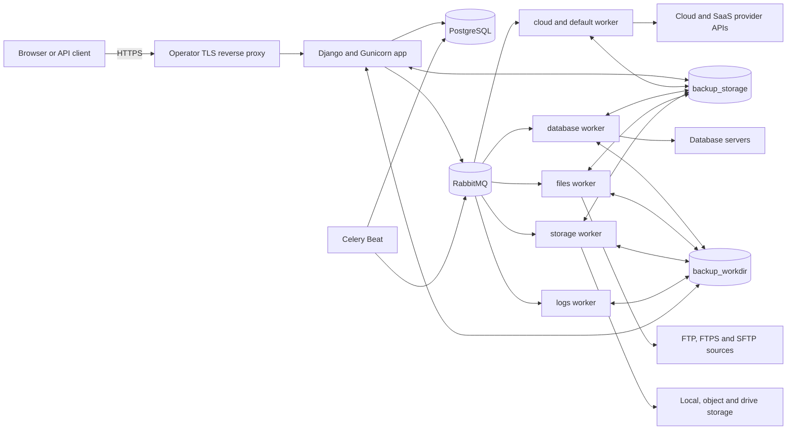
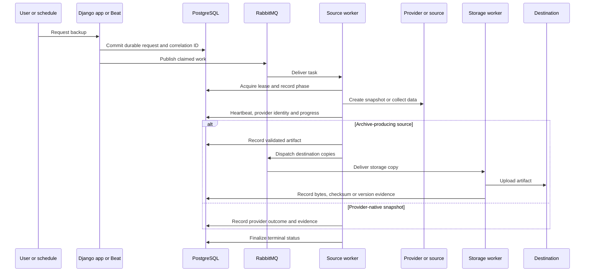

# Architecture

BackupSheep is a self-hosted Django control plane. It records configuration and durable
execution state in PostgreSQL, uses RabbitMQ to transport Celery work, and delegates
provider snapshots, data collection, storage copies and restores to separate worker
lanes. The stock deployment builds one application image and runs it in several roles.

## System context

The reverse proxy is an operator-supplied component; the repository does not ship a TLS
proxy. PostgreSQL, RabbitMQ, the app, workers and Beat are defined in
`docker-compose.yml`.

## Runtime components

| Component | Stock command or image | Responsibility | Scale notes |
| --- | --- | --- | --- |
| `db` | `postgres:18` | Accounts, configuration, schedules, credentials, backup/restore records, leases and evidence | Use one primary or an external managed PostgreSQL service |
| `rabbitmq` | `rabbitmq:3-management` | Durable Celery queues and persistent message delivery | Use a compatible RabbitMQ topology when externalized |
| `migrate` | `python manage.py migrate --noinput` | Applies schema migrations before other application roles start | One-shot; must complete successfully |
| `app` | image entrypoint, then Gunicorn on port 8000 | Console, REST API, onboarding, connection validation and static files through WhiteNoise | Scale only behind a proxy and with shared state/mounts |
| `worker-cloud` | queues `cloud,default`, concurrency 8 | Provider API snapshots/restores and general work | Does not use `backup_workdir`; stock Compose mounts Local Storage |
| `worker-database` | queue `database`, concurrency 4 | PostgreSQL, MySQL and MariaDB dump/restore work | CPU/disk heavy; requires shared work and Local Storage mounts |
| `worker-files` | queue `files`, concurrency 4 | Website collection/restore plus WordPress and Basecamp collection | CPU/disk heavy; requires shared work and Local Storage mounts |
| `worker-storage` | queue `storage`, concurrency 4 | Copies finished artifacts to destinations, finalizes and cleans work files | Scale for measured upload backlog; requires both mounts |
| `worker-logs` | queue `logs`, concurrency 4 | Activity entries, notifications and local run-log pruning | Requires the work mount for log pruning |
| `beat` | database-backed `BackupDatabaseScheduler` | Scheduled backups, recovery sweeps and maintenance dispatch | Keep one instance for ordinary maintenance cadence |

Queue routing is declared in Django settings, not in Compose labels. Starting a generic
Celery worker without the intended queue set can starve a lane or run disk-touching work
where its files are absent.

## Persistence and filesystem topology

| Compose volume | Container path | Authoritative contents |
| --- | --- | --- |
| `pgdata` | `/var/lib/postgresql` | PostgreSQL cluster for the bundled database |
| `rabbitmq_data` | `/var/lib/rabbitmq` | Broker metadata and queued messages |
| `backup_workdir` | `/code/_storage` | In-flight artifacts, restore/run logs, website caches, SSH trust material and optional managed key |
| `backup_storage` | `/backups` | Archives for the Local Storage destination |

PostgreSQL is the control-plane source of truth. RabbitMQ is a delivery mechanism: a lost
message can be republished from durable request state by recovery sweeps. The work volume
contains important transient state but does not replace the database. `backup_storage` is
durable customer backup data whenever Local Storage is selected.

All roles that touch a file must see the same bytes at the same container path. Docker
named volumes satisfy that condition on one host. A multi-host deployment requires a
shared filesystem for `backup_workdir`; it also requires shared durable storage for
`/backups` when Local Storage is used. A container-local directory is not sufficient.

See [Configuration](../guides/configuration.md#filesystem-configuration) and
[Disaster recovery](../guides/disaster-recovery.md) for mount and protection rules.

## Backup execution flow

The precise provider phases vary, but the common control flow is:

The request and execution rows are written before relying on the broker. The execution
record carries a correlation ID, current phase, attempts, retry time, progress, leases,
provider operation/resource identity and reconciliation metadata. Archive-producing jobs
also create artifact and per-destination copy records.

The public API exposes a redacted `execution_status` projection. Credentials, raw provider
payloads and worker lease tokens are not part of that contract.

## Scheduling and duplicate avoidance

Celery Beat reads schedules through BackupSheep's database scheduler. A scheduled backup
occurrence is transactionally claimed, so two dispatch attempts converge on one durable
occurrence. Keep Beat singleton anyway: ordinary maintenance tasks do not all share that
occurrence guard, and duplicate schedulers add avoidable load.

Workers use renewable leases and heartbeats around long work. Database recovery tasks run
periodically and can reclaim stale dispatches or executions. Provider mutation paths
persist correlation data, operation IDs and ownership markers, then reconcile after an
ambiguous response. If zero, multiple or mismatched candidates remain, execution stops
for manual review instead of guessing.

This design is intended to survive worker exit, broker redelivery and server restart, but
it does not make arbitrary manual provider actions idempotent. Operators must preserve
the durable row and use its exact identifiers during incident response.

## Restore flow and safety

Restores have their own durable rows, dispatch leases, worker leases, heartbeats and stale
recovery sweep. Depending on the source, restore either:

- reconstructs an archive and writes it to a selected website/database target;
- creates a new provider resource from a snapshot or backup;
- copies backed-up S3/DynamoDB data to a deliberately selected destination; or
- restores a managed-provider backup through its native API.

Archive restores validate member count, total expanded bytes, compression ratio, paths,
manifest/checksum information and free-disk reserve before extraction. Website restore
supports overlay behavior and an explicit exact-mirror mode; exact mirror can delete
remote files that are absent from the backup and therefore needs separate confirmation.

Provider restore behavior is summarized in the [provider matrix](provider-matrix.md).

## Authentication, authorization and secret boundaries

The application supports:

- browser sessions, with CSRF validation for session-authenticated API mutations;
- API tokens sent as `Authorization: Token ...`;
- account/member/group scoping enforced in API permissions and querysets;
- a one-time infrastructure-access token protecting creation of the first owner.

Provider, source and destination credentials entered in the console are encrypted using a
per-account key stored in PostgreSQL. Email-provider credentials saved by the setup flow
use key material derived from `DJANGO_SECRET_KEY`. PostgreSQL backups and `.env` therefore
belong in the same high-sensitivity recovery class even though individual fields are
encrypted.

Workers necessarily receive decrypted credentials for the operation they execute. Keep
the Compose network private, restrict host access, avoid dumping process environments,
and isolate external RabbitMQ/PostgreSQL with TLS and network controls.

## Network boundaries

Only the reverse proxy needs to reach the app on port 8000. PostgreSQL, RabbitMQ and the
RabbitMQ management UI should not be published to the internet. Workers require outbound
access to the configured source, storage and provider endpoints; SFTP/SSH sources also
require reviewed host keys.

With `DJANGO_HTTPS=true`, Django trusts `X-Forwarded-Proto` from the proxy, redirects HTTP,
uses secure cookies and enables HSTS. Configure this only behind a proxy that overwrites
forwarded headers and preserves the intended `Host` value.

## Health and observability boundaries

`GET /healthz/` is a web-process liveness probe only. It does not query PostgreSQL,
RabbitMQ, workers, storage or providers. Readiness and recoverability require combined
dependency checks, queue consumers, durable execution state, artifact evidence and a
restore rehearsal. See [Observability](../guides/observability.md).

## Extension points

Provider source integrations live under `apps/_tasks/integration/`; destination adapters
live under `apps/_tasks/integration/storage/`; the API is rooted at `/api/v1/`. A complete
new integration normally needs models/migrations, account-scoped serializers and views,
task routing, safe error normalization, encrypted credential handling, durable recovery,
tests, console setup and reference-data updates. Adding an icon or seed row alone does not
make an integration operational.
