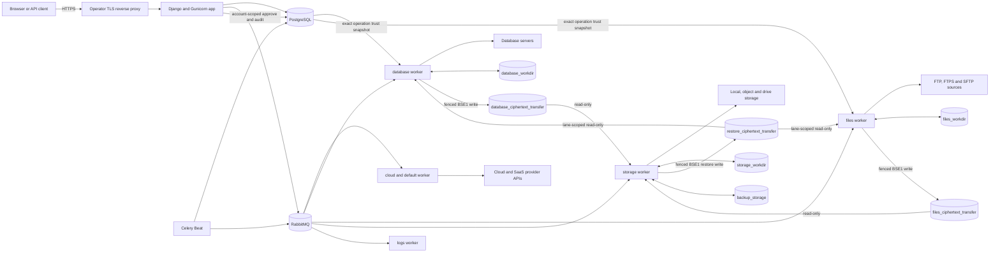
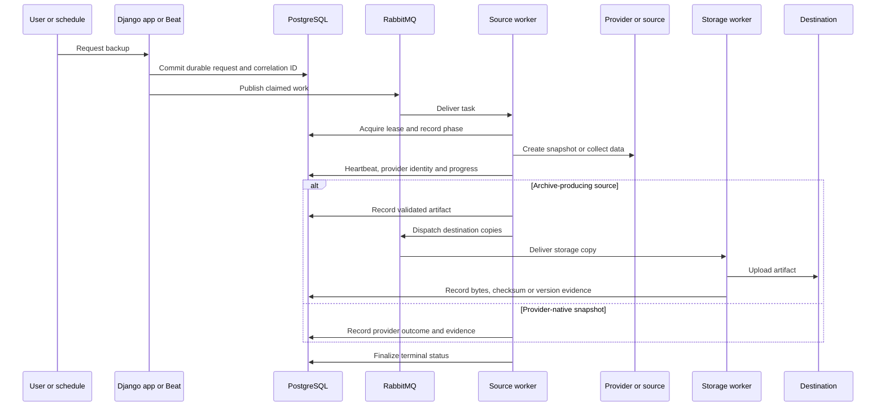

# Architecture

BackupSheep is a self-hosted Django control plane. It records configuration and durable
execution state in PostgreSQL, uses RabbitMQ to transport Celery work, and delegates
provider snapshots, data collection, storage copies and restores to separate worker
lanes. The stock deployment builds one application image for several roles and one
minimal derived PostgreSQL image.

## System context

The reverse proxy is an operator-supplied component; the repository does not ship a TLS
proxy. PostgreSQL, RabbitMQ, the app, workers and Beat are defined in
`docker-compose.yml`.

A profile-less Compose start deliberately runs only PostgreSQL, RabbitMQ, database
identity provisioning, migrations, the security preflight and the web app. Every
provider worker and Beat belongs to the explicit `operations` profile because enabling
it can execute queued or recoverable provider work.

## Runtime components

| Component | Stock command or image | Responsibility | Scale notes |
| --- | --- | --- | --- |
| `db` | locally built `backupsheep-postgres:<commit>` rooted in digest-pinned `postgres:18.6-alpine3.24` | Accounts, configuration, schedules, credentials, backup/restore records, leases and evidence | Image and Compose fix UID/GID `70:70`, drop every capability and exec PostgreSQL as non-root PID 1; active storage is installation-witnessed ICU `und`; legacy Debian storage is never auto-mounted |
| `rabbitmq` | locally built `backupsheep-rabbitmq:<commit>` rooted in digest-pinned `rabbitmq:4.3.5-alpine` with reviewed package updates and no enabled plugins | Durable Celery queues and persistent message delivery | A separate capability-free volume-init gate proves exact `100:101` ownership and installation/generation witnesses before the broker starts directly as non-root PID 1; dedicated credentials/vhost; backend network only |
| `db-provision` | `python -m backupsheep.database_identity provision` | Creates/rotates installation-marked migrator/runtime roles, transfers reviewed public ownership and applies runtime DML grants in one transaction | One-shot on a dedicated database bridge; sole application-image recipient of the bootstrap credential |
| `migrate` | `python manage.py migrate_and_verify_artifact_provider` | Applies schema migrations, then freshly proves pending adoption has no wraps or legacy/unledgered backup, storage-point or artifact inventory; sealed production must have exact `local-file`/BSE1 custody and verified destination evidence | One-shot; must complete successfully on every run even when migrations were already recorded |
| `preflight` | `python manage.py docker_preflight` | Fails closed on unsafe identity/capability/rootfs/secret/runtime settings, pending migrations, and unavailable database/broker dependencies | One-shot; must complete successfully |
| `app` | image entrypoint, then Gunicorn on port 8000 | Console, REST API, onboarding, connection validation and static files through WhiteNoise | Scale only behind a proxy; no work, transfer or Local Storage mount |
| `worker-cloud` | queues `cloud,default`, concurrency 4 | Provider API snapshots/restores and general work | Operations profile; no work, transfer or Local Storage mount |
| `worker-database` | queue `database`, concurrency 1 | PostgreSQL, MySQL and MariaDB dump/restore work plus database run-log pruning | Operations profile; CPU/disk heavy; private work plus database-forward/restore-transfer grants; no Local Storage mount |
| `worker-files` | queue `files`, concurrency 1 | Website collection/restore, Basecamp collection, incremental-cache reset and files run-log pruning | Operations profile; CPU/disk heavy; private work plus files-forward/restore-transfer grants; no Local Storage mount |
| `worker-storage` | queue `storage`, concurrency 2 | Copies BSE1 artifacts to destinations, downloads restore ciphertext, finalizes storage state and prunes destination-upload run logs | Operations profile; private work; read-only source transfers; writable restore transfer and Local Storage; scale for measured backlog |
| `worker-logs` | queue `logs`, concurrency 2 | Database activity entries, notifications and database-activity pruning | Operations profile; no work, transfer or Local Storage mount |
| `beat` | database-backed `BackupDatabaseScheduler` | Scheduled backups, recovery sweeps and maintenance dispatch | Keep one instance for ordinary maintenance cadence |

Queue routing is declared in Django settings, not in Compose labels. Starting a generic
Celery worker without the intended queue set can starve a lane or run disk-touching work
where its files are absent.

Queue names by themselves are not an authorization boundary. Stock Compose adds a distinct
RabbitMQ principal with fixed queue ACLs for each lane and requires lane-bound signed task
envelopes with replay tracking. Preserve both controls: a generic worker, broader broker
permission, unsigned compatibility path or shared signing key would reopen cross-lane
command relay. Durable task-specific execution fences remain necessary for late-ack crash
recovery even with broker authentication.

Application roles use fixed lane identities: web `10001`, database `10002`, files `10003`,
storage `10004`, logs `10005`, Beat `10006`, migration/preflight `10007` and cloud `10008`
(UID and primary GID match). They have read-only roots, all Linux capabilities dropped,
`no-new-privileges`, bounded tmpfs/resource limits and no host PID/IPC namespace sharing.
Each Internet-capable role shares only its network namespace with a no-secret egress
guard and retains a private PID namespace. Mount, IPC, user and secret contexts also
remain separate. The guard/workload pair must be recreated together: the wrapper refuses
independent guard lifecycle commands, and guard restart policy is `"no"` so Docker cannot
silently replace the namespace owner beneath a running workload.
The guard drops to UID/GID `10020:10020`, retains only `NET_ADMIN`, and permits the current
database and broker peers as exact interface/address/TCP-port tuples on two distinct
directly connected internal bridges. It refreshes those sets after Docker DNS changes and
blocks both on absence or ambiguity; no bridge subnet is trusted. Each role also has its
own outward bridge. The stock stack mounts only the secret files each role needs; the
onboarding token is granted to `app` alone.

Stock generation-2 `deny` mode permits only the exact internal database and broker peers
and blocks every outward destination. Strict `allowlist` adds exact IPv4 `CIDR:port` or
IPv6 `[CIDR]:port` TCP tuples. `deny` and `allowlist` redirect workload Docker-DNS queries
to a loopback-only zero-capability UID-`10021` parser. It can send only an immutable
allowed-name index and A/AAAA selector to a distinct zero-capability UID-`10022`
forwarder, which alone constructs canonical queries and reaches Docker DNS. Direct
external TCP/UDP 53 is blocked. The complete exact-name policy is capped at 66 unique
names, including DB/broker names, and every CNAME target needs its own entry.

DNS and tuple grants are independent. They are transport-level defense in depth, not a
resource-aware boundary; another tenant on the same IP and port remains reachable.
Enterprise operations require dedicated/private endpoints or a resource-aware proxy.
`public` uses ordinary DNS and is an explicit compatibility risk opt-in; exact tuples are
special-range exceptions intended only for narrow reviewed private targets. They cannot
override fixed `never` destinations or discovered gateways; the fixed set includes both
well-known NAT64 prefixes. They can override only the ordinary private/reserved set.
Deployment-specific NAT64 remains a host/network control.

Guard health requires a successful renewal witness younger than the kernel lease, not
PID-1 liveness. Workload health separately proves local web/worker readiness and fresh
TCP connections to both database and broker through the current exact peer sets. Guard
loss, lease expiry, peer revocation, or a stranded old namespace therefore makes the
workload unhealthy without granting it authority to restart the pair.

Every application-image command passes through the image entrypoint. It neutralizes
shell, Python, dynamic-loader and TLS-key-log startup hooks; verifies the fixed identity,
empty capability sets, `NoNewPrivs`, seccomp, Docker init, private mounts, read-only root
and absence of a Docker socket; and executes configured argv without shell evaluation.
After Compose's one-shot deployment gate, the same entrypoint runs `docker_preflight`
again before every web, worker and Beat process. This catches weakened settings or runtime
flags when Docker later auto-restarts a service without recreating the one-shot gate, but
it does not recover or attest a `restart: "no"` guard after a Docker daemon restart.
Long-running application services use `restart: unless-stopped`; namespace guards use
`restart: "no"`. The wrapper refuses independent guard lifecycle commands and requires
each workload/guard pair to be recreated together, including daemon-restart recovery. The
installer uses ordinary `down` to
remove the complete container/network topology before every build or migration while
preserving named data/identity volumes. An operations-only pause explicitly stops the
workers and Beat and leaves the no-secret guards in place.

PostgreSQL's derived build verifies the exact official 18.6 Alpine 3.24 entrypoint bytes,
replaces its `gosu` transition with exact `su-exec=0.3-r0`, deletes `gosu`, and declares
UID/GID `70:70`. Stock Compose repeats that user, drops all capabilities, and starts
PostgreSQL without a root ownership-repair phase. An installation-bound marker permits
only the distinct ICU `und` generation; the older Debian/UID-999 volume remains detached
rollback evidence after the explicit logical migration.
RabbitMQ remains the sole deliberate bootstrap exception: its reviewed entrypoint gets a
narrow capability set to repair named-volume ownership, drops to the vendor UID, and
execs the non-root server. Neither service uses Docker's root-owned init shim. Verify UID,
capabilities and PID 1 whenever either pinned image changes.

## Persistence and filesystem topology

| Compose volume | Container path | Authoritative contents |
| --- | --- | --- |
| `postgres_data_v1` | `/var/lib/postgresql` | Active PostgreSQL 18.6 Alpine/ICU cluster, bound to its installation/storage witness |
| retired `pgdata` | not mounted by stock Compose | Detached Debian/UID-999 rollback evidence after an explicit logical migration |
| `rabbitmq_data` | `/var/lib/rabbitmq` | Broker metadata and queued messages |
| `database_workdir` | `/code/_storage` in database only | Private plaintext database work and database run logs |
| `files_workdir` | `/code/_storage` in files only | Private plaintext file-source work, incremental cache and files-lane run logs |
| `storage_workdir` | `/code/_storage` in storage only | Private BSE1 materialization, provider transfer work and destination-upload run logs |
| `database_ciphertext_transfer` | `/var/lib/backupsheep/transfer/database` | Database-writable, storage-read-only fenced BSE1 handoff |
| `files_ciphertext_transfer` | `/var/lib/backupsheep/transfer/files` | Files-writable, storage-read-only fenced BSE1 handoff |
| `restore_ciphertext_transfer` | `/var/lib/backupsheep/restore-transfer` | Storage-writable, database/files read-only lane-fenced BSE1 restore handoff |
| `backup_workdir` | `/volumes/legacy-work` in `staging-provision` only | Legacy shared-work emptiness evidence; never mounted at runtime |
| `staging_layout_witness` | `/var/lib/backupsheep-staging` in `staging-provision` only | Installation-bound v3 filesystem-layout witness |
| `backup_storage` | `/backups` in storage only | BSE1 archives for the Local Storage destination |
| `installation_identity` | `/run/backupsheep-installation` in `app` (read-only) | Empty persistent ownership sentinel labeled with the installation's stable 64-hex ID; contains no application or secret data |

PostgreSQL is the control-plane source of truth. RabbitMQ is a delivery mechanism: a lost
message can be republished from durable request state by recovery sweeps. Private work and
transfer volumes contain important transient state but do not replace the database.
`backup_storage` is durable customer backup data whenever Local Storage is selected.

Plaintext never crosses the runtime filesystem boundary between source and storage lanes.
Database and files write only their own private work volume, seal an authenticated BSE1
envelope, and publish it through their separate transfer volume. Storage can read but not
write those published handoffs; it receives no source plaintext. For restores, storage
writes BSE1 into the reverse transfer and the exact database/files reader consumes only its
lane. Web, cloud, logs and Beat receive no work or transfer mount. SSH host-key approvals and their
append-only audit events are account-scoped PostgreSQL state, not a shared filesystem.
Database/files workers materialize only the exact approved keys for one operation in a
mode-`0600` private-runtime file and remove it afterward. Only storage mounts `/backups`,
read/write. `reset_incremental_cache` stays in the files lane. Files run-log pruning runs
there at 03:00 UTC, database run-log pruning stays in the database lane at 03:05 UTC,
destination-upload run-log pruning stays in the storage lane at 03:10 UTC, and PostgreSQL
`CoreLog` pruning is separate at 03:30 UTC. Reset is confined beneath the expected
node cache with directory-file-descriptor operations and no-follow checks, and takes the
same per-node incremental lock as archive/mirror work before deleting anything.

Optional managed SSH identities have a separate, lane-specific boundary. Compose grants
`.secrets/ssh_managed_database_private_key` only to `worker-database` and
`.secrets/ssh_managed_files_private_key` only to `worker-files`; the app and every other
role receive neither private key. Each non-empty source must be a regular, NUL-free,
unencrypted Ed25519 key no larger than 64 KiB. The entrypoint copies the lane's accepted
key into private tmpfs as `/run/backupsheep/ssh/managed_private_key` with mode `0600`.
The two identities must be distinct. Managed-key mode is enabled only when PostgreSQL
contains exactly one account; a second account atomically disables and fences it. A
multi-account installation uses customer-supplied, account-scoped private keys instead.

Stock Compose is a single-host model. A separately reviewed multi-host orchestrator must
preserve three private work stores, two source-specific one-way ciphertext transfers, the
reverse lane-fenced restore transfer, and storage-only Local Storage rather than replacing
them with one shared plaintext filesystem. PostgreSQL carries account-scoped SSH approvals
and audit history. Deliver each optional managed identity only to its matching worker lane,
or use customer-supplied keys; preserve every role-specific read/write and group boundary.

See [Configuration](../guides/configuration.md#filesystem-configuration) and
[Disaster recovery](../guides/disaster-recovery.md) for mount and protection rules.

## Backup execution flow

The precise provider phases vary, but the common control flow is:

The request and execution rows are written before relying on the broker. The execution
record carries a correlation ID, current phase, attempts, retry time, progress, leases,
provider operation/resource identity and reconciliation metadata. Archive-producing jobs
also create artifact and per-destination copy records.

The public API exposes a redacted `execution_status` projection. Credentials, raw provider
payloads and worker lease tokens are not part of that contract.

Activity/notification creation follows a narrower broker boundary. The request-side role
first persists a `CoreLog` row. When notification fan-out is required, it waits for the
surrounding database transaction to commit and queues only the opaque integer row ID to
the logs queue. The logs worker reloads the row and performs Slack/Telegram network I/O.
A dictionary payload is accepted only to drain messages left by older releases during an
upgrade; new code must not publish log bodies, provider credentials or arbitrary error
details through RabbitMQ.

## Scheduling and duplicate avoidance

Celery Beat reads schedules through BackupSheep's database scheduler. A scheduled backup
occurrence is transactionally claimed, so two dispatch attempts converge on one durable
occurrence. Keep Beat singleton anyway: ordinary maintenance tasks do not all share that
occurrence guard, and duplicate schedulers add avoidable load.

Workers use renewable leases and heartbeats around long work. Database recovery tasks run
periodically and can reclaim stale dispatches or executions. Provider mutation paths
persist correlation data, operation IDs and ownership markers, then reconcile after an
ambiguous response. If zero, multiple or mismatched candidates remain, execution stops
for manual review instead of guessing.

This design is intended to survive worker exit, broker redelivery and server restart, but
it does not make arbitrary manual provider actions idempotent. Operators must preserve
the durable row and use its exact identifiers during incident response.

## Restore flow and safety

Restores have their own durable rows, dispatch leases, worker leases, heartbeats and stale
recovery sweep. Depending on the source, restore either:

- reconstructs an archive and writes it to a selected website/database target;
- creates a new provider resource from a snapshot or backup;
- copies backed-up S3/DynamoDB data to a deliberately selected destination; or
- restores a managed-provider backup through its native API.

Archive restores validate member count, total expanded bytes, compression ratio, paths,
manifest/checksum information and free-disk reserve before extraction. Website restore
supports overlay behavior and an explicit exact-mirror mode; exact mirror can delete
remote files that are absent from the backup and therefore needs separate confirmation.

Provider restore behavior is summarized in the [provider matrix](provider-matrix.md).

## Authentication, authorization and secret boundaries

The application supports:

- browser sessions, with CSRF validation for session-authenticated API mutations;
- API tokens sent as `Authorization: Token ...`;
- account/member/group scoping enforced in API permissions and querysets;
- a one-time infrastructure-access token protecting creation of the first owner.

Provider, source and destination credentials entered in the console are encrypted using a
per-account key stored in PostgreSQL. Email-provider credentials saved by the setup flow
use key material derived from `DJANGO_SECRET_KEY`. PostgreSQL backups, `.env` and the stock
`.secrets` directory therefore belong in the same high-sensitivity recovery class even
though individual fields are encrypted.

Workers necessarily receive decrypted credentials for the operation they execute. Stock
Compose reduces ambient deployment-wide credentials despite retaining `.env` compatibility:
web receives all families needed for setup/OAuth callbacks, cloud only DigitalOcean/OVH,
files only Basecamp, storage only Dropbox/pCloud/Microsoft/Google, and logs only
Postmark/Mailgun/SES/Slack/Telegram. Database, Beat and one-shot roles receive none. The
shared environment blanks every family first and the immutable entrypoint refuses a
misplaced non-empty value. Sentry DSN remains shared because every Django/Celery process
initializes the scrubbed client and the DSN is an ingest identifier, not provider-account
authorization. Keep the Compose network private, restrict host access, avoid dumping
process environments, and isolate external RabbitMQ/PostgreSQL with TLS and network
controls.

## Network boundaries

Only the reverse proxy needs to reach the app on port 8000. PostgreSQL, RabbitMQ and the
RabbitMQ management UI should not be published to the internet. Workers require outbound
access to the configured source, storage and provider endpoints; SFTP/SSH sources also
require reviewed host keys.

With `DJANGO_HTTPS=true`, Django trusts `X-Forwarded-Proto` from the proxy, redirects HTTP,
uses secure cookies and enables HSTS. Configure this only behind a proxy that overwrites
forwarded headers and preserves the intended `Host` value.

## Health and observability boundaries

`GET /healthz/` is a web-process liveness probe only. It does not query PostgreSQL,
RabbitMQ, workers, storage or providers. Readiness and recoverability require combined
dependency checks, queue consumers, durable execution state, artifact evidence and a
restore rehearsal. See [Observability](../guides/observability.md).

## Extension points

Provider source integrations live under `apps/_tasks/integration/`; destination adapters
live under `apps/_tasks/integration/storage/`; the API is rooted at `/api/v1/`. A complete
new integration normally needs models/migrations, account-scoped serializers and views,
task routing, safe error normalization, encrypted credential handling, durable recovery,
tests, console setup and reference-data updates. Adding an icon or seed row alone does not
make an integration operational.
